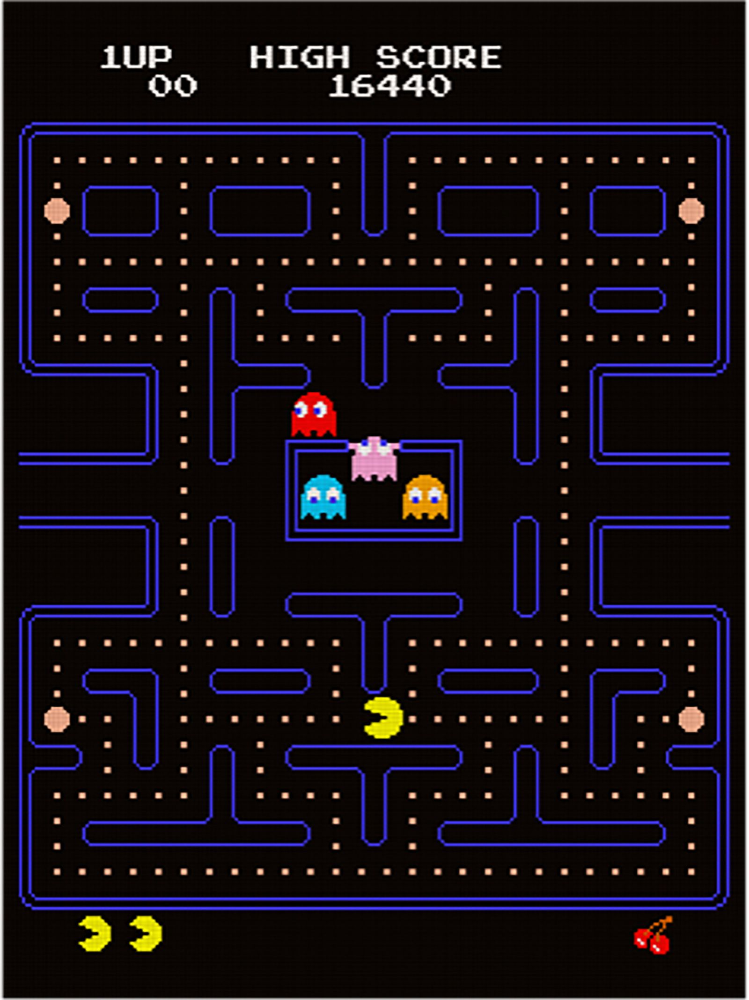

# Introducció a la Programació Orientada a Objectes

## 📚 Part 1. Hello World !

### Per què aprendre Programació Orientada a Objectes?

	- Perquè permet programar més ràpid, això es deu al fet que es fa una anàlisi prèvia del que s'aquesta realitzant.
	- En saber analitzar problemes i entendre la programació orientada a objectes es pot avançar i deixar de ser un programador Júnior. Això es deu al fet que diverses de les preguntes més freqüents dels reclutadors són *Què és l'encapsulament, l'abstracció, l'herència o el polimorfisme?*
	- Saber POO permet deixar la dolenta pràctica de copiar i pegar codi i prendre el control del projecte i el codi.

### Per què POO?

La programació orientada a objectes permet que el codi sigui reutilitzable, organitzat i fàcil de mantenir. Segueix el principi de desenvolupament de programari utilitzat per molts programadors i programadores arreu del món ***DRY*** (Don’t Repeat Yourself), per a evitar duplicar el codi i crear d'aquesta manera programes eficients. A més, evita l'accés no desitjat a les dades o l'exposició de codi propietari mitjançant l'encapsulació i l'abstracció, de la qual parlarem detalladament més endavant.

 
### Paradigma de la orientació a objectes

La programació orientada a objectes o POO és un **paradigma** de programació que utilitza objectes i les seves interaccions, per a dissenyar aplicacions i programes de computadores. Està basat en diverses tècniques, incloent-hi **herència**, **abstracció**, **polimorfisme** i **encapsulament**.

Un paradigma de programació representa un enfocament particular o filosofia per a la construcció del programari. No és millor un que un altre sinó que cadascun té avantatges i desavantatges.

En la POO les entitats centrals són els objectes, que són tipus de dades que encapsulen amb el mateix nom estructures de dades, operacions o algorismes que manipulen aquestes dades.

📌**Objecte**: Entitat proveïda d'un conjunt de propietats o atributs (dades) i de comportament o funcionalitat (mètodes) els mateixos que conseqüentment reaccionen a esdeveniments. Es correspon amb els objectes reals del món que ens envolta, o a objectes interns del sistema (del programa). És una instància a una classe.  
  

## 📚 Part 2. Orientació a objectes

### Objectes

Quan hi ha un problema que es vol resoldre amb Programari el primer que cal fer és **identificar els Objectes**.

- **Com identificar als Objectes?** Els **objectes** són aquells que tenen propietats i comportaments. Sempre són substantius. Poden ser físics (un Usuari per exemple) o conceptuals, és a dir, que no existeixen físicament, són simbologies de processos que duu a terme el programari que s'aquesta construint (una de Sessió d'Usuari per exemple).
- **Què són els atributs?** També anomenades **propietats**. Són característiques que descriuen a un objecte (per exemple: nom, grandària, forma, estat). Els atributs també són substantius.
- **Què són els comportaments?** També se'ls coneix com a **mètodes**. Són totes les operacions/accions de l'objecte (per exemple: *login(), logout(), makeReport()*). Solen ser verbs o substantiu i verb.

### Abstracció i classes

El concepte **classe** està íntimament relacionat amb el concepte objecte. Podem definir informalment una classe com una plantilla (o esquelet o pla) a partir de la qual es creen els objectes. 

Per exemple, en el món hi ha milions de televisors de la mateixa marca i model. Cadascun d'aquests televisors ha estat muntat a partir d'un mateix pla/esquelet/plantilla i, conseqüentment, tots ells tenen els mateixos components, connexions i funcionalitats. Aquest pla/esquelet/plantilla és, en termes de programació orientada a objectes, una classe.

Per consegüent, una classe descriu les característiques i el comportament d'un conjunt d'objectes similars en un context determinat.

📌**Classe**: més formalment, també podeu entendre una classe com **l'abstracció** d'un objecte o com la definició d'un objecte.

\
📌**Abstracció**: és la propietat que permet representar les característiques essencials d'un objecte sense preocupar-se de les restants característiques. Se centra en la vista externa d'un objecte de manera que serveix per a separar el comportament essencial d'un objecte, de la seva implementació.

### Modularitat

Consisteix a dividir un sistema en parts més petites, cadascuna d'aquestes parts es diuen **mòduls**. Cadascun d'aquests mòduls funciona de manera independent, però junts conformen el sistema complet.

La modularitatd permet fer més fàcil el manteniment i l'escalabilitat d'un projecte, perquè mentre en les programació estructurada es té un només arxiu molt gran en el qual aquesta tota la lògica del sistema i en el qual un error pot detenir l'execució de tot el programa, en la programació orientada a objectes les diferents funcions d'un sistema es divideixen en mòduls independents, per la qual cosa a l'hora de solucionar ***bugs*** només cal situar el mòdul que aquesta fallant i reparar-lo sense haver d'afectar la resta del codi; i si es volen afegir més funcionalitats al projecte només cal crear nous mòduls i integrar-los dins del sistema.

 **Avantatges de la modularitat:**
 
 La modularitat contribueix a:

 - Reduir la complexitat del problema.
 - Reduir la grandària del problema.
 - Afavorir l'enteniment del problema.
 - Facilitar la cooperació entre programadors.
 - Reutilitzar codi.
 - Faciliten la lectura del codi.
 - Ajuda a ser més clara la lògica del programa (*Julien Hennefeld*)

Les classes són l'element que permet la modularitat en la POO, perquè permeten dividir el problema en diferents classes/mòduls i al seu torn separar aquestes classes en diferents arxius.
  
# Part 3. Possem un exemple ...

## PAC-MAN 

[Pac-man](https://ca.wikipedia.org/wiki/Pac-Man) és un videojoc recreatiu creat pel dissenyador de videojocs Toru Iwatani de l'empresa Namco, i distribuït per Midway Games al mercat americà a principis dels anys 1980 ... seguix a la wikipèdia ...

{width=25%}
    

### **Anàlisi del problema:**

**Anàlisi dels objectes**

|   PacMan   |
|------------|
|  nom       |
| velocitat  |
