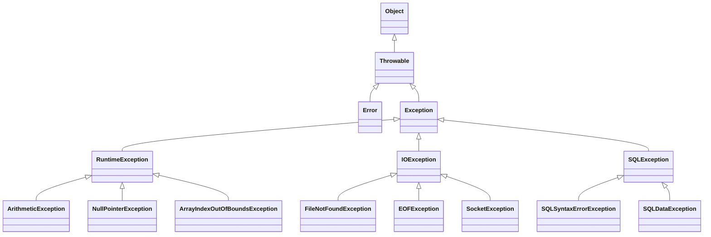

# Introducció a les Excepcions en Java
Les excepcions permeten que un mètode informe al codi que l'ha invocat sobre algun error o situació anòmala que s'hagi produït durant la seva execució.

Per exemple, suposem un mètode que rep un codi postal i retorna el nom de l'Ajuntament al qual pertany. En el cas normal que el codi postal sigui correcte, el mètode retornaria el nom de l'ajuntament. En el cas que el codi postal que se li hagi passat no existeixi o el seu format sigui incorrecte, el mètode el notificaria llançant una excepció. Una excepció a Java és un objecte de la classe `Exception` o d'alguna de les seves subclasses.

## Jerarquia d'Excepcions
Les excepcions en Java estan organitzades en una jerarquia d'herència, amb la classe `java.lang.Exception` com a classe arrel. Aquesta classe té diverses subclasses, com `RuntimeException`, que són excepcions que es poden evitar amb una programació més rigorosa, i altres excepcions que són comprovades en temps de compilació.

### Diagrama de classes


L'arbre de classes d'exepcions és força més gran i pots consultar-ho [aquí](https://docs.oracle.com/en/java/javase/11/docs/api/java.base/java/lang/Exception.html).

* **Object**: La classe base de tots els altres objectes en Java. Conté mètodes comuns que es poden utilitzar per a totes les classes.
* **Throwable**: La classe arrel de la jerarquia d'excepcions. Totes les excepcions i errors són subclasses de Throwable.
* **Error**: Representa errors greus que normalment no es poden gestionar pel programador. Són situacions irrecuperables que normalment provoquen la terminació del programa.
* **Exception**: La classe arrel per a totes les excepcions que no són errors. Les excepcions es poden gestionar i recuperar.
* **RuntimeException**: Excepcions que es produeixen durant l'execució del programa. Són excepcions que podrien evitar-se amb una programació més rigorosa.
* **IOException**: Excepcions relacionades amb l'entrada i sortida (I/O), com ara la lectura o escriptura de fitxers.
* **SQLException**: Excepcions relacionades amb errors en la manipulació de bases de dades SQL.
* **ArithmeticException**: Es produeix quan es realitza una operació aritmètica inadequada, com una divisió per zero.
* **NullPointerException**: Es produeix quan s'intenta accedir a un objecte que té un valor null.
* **FileNotFoundException**: Es produeix quan s'intenta accedir a un fitxer que no es pot trobar.
* **ArrayIndexOutOfBoundsException**: Se produce cuando se intenta acceder a un índice de un array fuera de su rango válido. 
* **EOFException**: Se produce cuando se intenta leer datos desde una secuencia y se alcanza el final del archivo (EOF) antes de leer la cantidad esperada de datos. 
* **SocketException**: Excepción relacionada con operaciones de sockets, como problemas de conexión o cierre inesperado. 
* **SQLSyntaxErrorException**: Excepción específica de SQL que se produce cuando hay errores de sintaxis en una sentencia SQL. 
* **SQLDataException**: Excepción específica de SQL para problemas con los tipos de datos en una base de datos.

## Excepcions Personalitzades
En algunes situacions, és útil crear excepcions personalitzades que reflecteixin situacions específiques del nostre programa. Això es pot fer creant una nova classe que hereti de Exception o d'altres subclasses d'Exception.

```java
// Exemple d'una excepció personalitzada
public class BadPostCodeException extends Exception {
    public BadPostCodeException(String missatge) {
        super(missatge);
    }
}
```

## Com es llança una excepció
Quan en un mètode necessitem llançar una excepció, utilitzarem la paraula clau `throw`, seguida d'una instància de l'excepció a llançar. Per exemple:

```java
if (postCode.length() != 5) {
    throw new BadPostCodeException("Un codi postal ha de terni 5 dígits!");
}
for (int i = 0; i < postCode.length(); i++) {
    if (!Character.isDigit(postCode.charAt(i))) {
        throw new BadPostCodeException("Els codis postals solament poden ser números!");
    }
}
City city = lookupPostCode(postCode);
if (city == null) {
    throw new BadPostCodeException("El codi postal no s'ha trobat: " + postCode);
}
```

Excepte en el cas d'un grup especial d'excepcions, en general un mètode que pugui potencialment llançar una excepció ha d'indicar-lo explícitament mitjançant la paraula clau `throws`  (fixa't a la "**s**" final, no ha de ser confosa amb `throw`) seguida del nom de la classe de l'excepció que pot llançar:

```java
public class PostCodeManager {
(...)

    public String town(String postCode) throws BadPostCodeException {
        if (postCode.length() != 5) {
            throw new BadPostCodeException("Un codi postal ha de terni 5 dígits!");
        }
        for (int i = 0; i < postCode.length(); i++) {
            if (!Character.isDigit(postCode.charAt(i))) {
                throw new BadPostCodeException("Els codis postals solament poden ser números!");
            }
        }
        City city = lookupPostCode(postCode);
        if (city == null) {
            throw new BadPostCodeException("El codi postal no s'ha trobat: " + postCode);
        }
        (...)
    }
(...)
}

```


## Què ocorre quan el llança una excepció?
Quan es produeix una excepció, la màquina virtual interromp l'execució normal del programa i cerca un bloc de codi adequat per a tractar la situació. Si no troba aquest codi en el mètode actual, l'excepció es propaga cap al mètode que l'hagi invocat i es busca allí el codi que la tracti. Si tampoc aquest mètode disposa del codi adequat, es propagarà al seu torn al que l'hagi invocat, i així successivament.

En aquest apartat s'explica el cas en què un mètode no disposa de codi adequat per a tractar una excepció. Com s'ha explicat, en aquest cas l'excepció es propaga al mètode que l'hagi invocat. Un mètode que no proporcioni codi per a tractar l'excepció ha de declarar que pot llançar l'excepció amb la paraula clau `throws` igual que s'explica en l'apartat anterior:

```java
public class Location {
(...)
    private String postCode;

    public String townAsString() throws BadPostCodeException {
        PostCodeManager manager = new PostCodeManager();
        String town = manager.town(postCode);
        return postCode + " " + town;
    }
(...)
}
```

En l'exemple, la invocació al mètode `town` pot potencialment llançar una excepció. El mètode `townAsString` no està proporcionant codi adequat per a tractar-la. Per tant, l'excepció es propagaria a través d'ell, i llavors també ha de declarar que pot llançar-la, com es veu en l'exemple.

Si en l'anomenada a `town` sorgeix una excepció, aquesta es propaga al mètode que hagi invocat a `townAsString`.

L'excepció continuarà propagant-se per la pila d'invocacions fins que en algun mètode sigui tractada. Si s'aconsegueix el mètode `main`, i aquest tampoc proporciona cap codi per a tractar-la, la màquina virtual tallarà l'execució del programa i mostrarà a l'usuari, normalment en pantalla, el missatge de l'excepció i la ubicació del programa en què s'hagi produït.

 ## Com es tracta una excepció

Un mètode pot decidir capturar una excepció si té sentit col·locar en aquest mètode el codi que la tracta adequadament. Per a capturar una excepció s'utilitza un bloc `try/catch`:
```java
try {
    // Bloc de codi que pot llançar una excepció
} catch (TipusExcepcio e) {
    // Gestió de l'excepció
} finally {
    // Bloc de codi que s'executa sempre, independentment de si es llança o no una excepció
}
```
En el moment en què sorgeixi l'excepció en el bloc `try`, es talla la seva execució i es passa a executar el codi del bloc `catch`. 
Una vegada finalitza el bloc `catch`, es continua amb l'execució de la resta del codi que segueixi a `try/catch`.
També es continua normalment en aquest punt si el bloc `try` finalitza sense que sorgeixin excepcions.

A continuació es mostra una implementació alternativa de `townAsString` en què es captura l'excepció:

```java
public class Location {
(...)
    private String postCode;

    public String townAsString() {
        String result;
        PostCodeManager manager = new PostCodeManager();
        try {
            String town = manager.town(postCode);
            result = postCode + " " + town;
        } catch (BadPostCodeException e) {
            result = "Ubicació desconeguda per al codi postal:" + postCode;
	}
        return result;
    }
(...)
}
```
Si en el mètode `town` sorgeix una excepció, es talla l'execució del bloc `try`, i per tant ja no s'executa la instrucció `result = postCode + " " + town`, sinó que el programa salta a l'interior del bloc `catch`. La instrucció `return result` s'executa sempre, sorgeixi o no alguna excepció, perquè està a continuació del bloc `try/catch`.

Fixa't que el mètode `townAsString` no declara en aquest cas que es llanci l'excepció. El motiu és que en capturar l'excepció, aquesta ja no pot propagar-se a través del mètode.