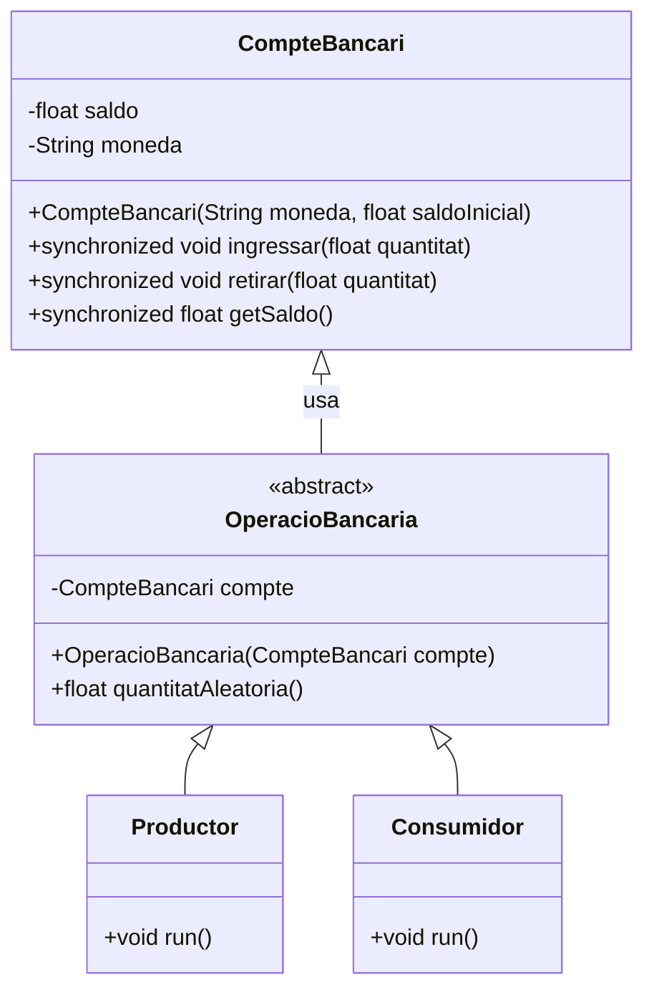
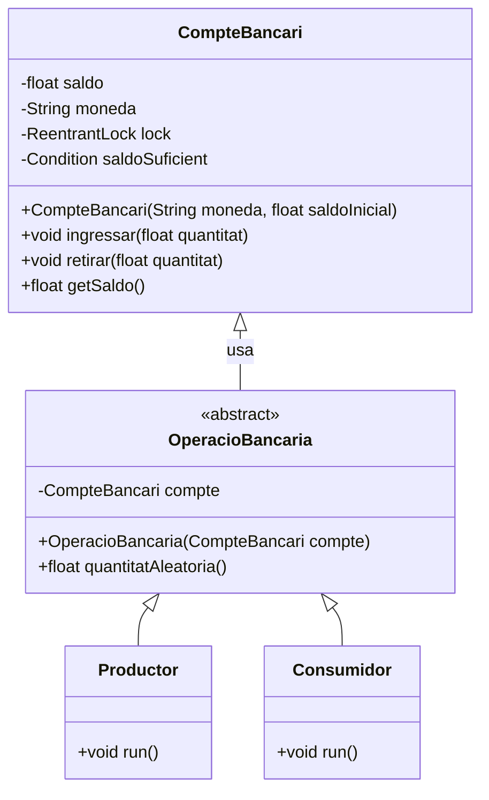

# Activitat 2 - *Syncronized Bank System*

## Objectiu

Desenvolupar un sistema en Java per gestionar transaccions en un `CompteBancari` mitjançant fils, practicant la
sincronització de fils amb monitors i `ReentrantLock`.
L'aplicació ha de gestionar situacions de saldo negatiu.

## Repàs de la teoria

### Mecanismes de sincronització

#### Monitors (Monitor lock)

A Java, la sincronització es fa mitjançant monitors: només un fil pot posseir un monitor en un instant de temps. Quan un
fil posseeix un, es diu que ha entrat en el monitor. Tots els altres fils que ho intentin seran suspesos fins que el
primer surti.
Podem utilitzar la paraula
reservada [synchronized](https://docs.oracle.com/javase/tutorial/essential/concurrency/syncmeth.html) al codi en tres
llocs, per a definir zones controlades per un
monitor:

* **Mètodes d'instància**: només un fil per instància pot executar un mètode sincronitzat. L'objecte monitor és la
  instància.
* **Mètodes de classe**: només un fil per classe pot executar un mètode sincronitzat. L'objecte monitor és la classe.
* **Blocs de codi**: s'ha d'indicar l'objecte monitor dins dels parèntesis. Només un fil per objecte monitor.

Un exemple de mètodes d'instància:

```java
public class SynchronizedCounter {
    private int c = 0;

    public synchronized void increment() {
        c++;
    }

    public synchronized void decrement() {
        c--;
    }

    public synchronized int value() {
        return c;
    }
}
```

\
**Conseqüències**:

* **Primer**, no és possible que dues invocacions dels mètodes sincronitzats al mateix objecte se solapin. Les
  subseqüents crides se suspenen fins que el primer fil acabi amb l'objecte.
* **Segon**, quan un mètode sincronitzat acaba, estableix una relació happens-before: les crides subseqüents tindran
  visibles els canvis fets.

**Important**: dins d'un bloc sincronitzat, cal fer la feina mínima possible: llegir les dades i si cal,
transformar-les.

Un exemple de blocs de codi:

```java
public class MsLunch {
    private long c1 = 0;
    private long c2 = 0;
    private Object lock1 = new Object();
    private Object lock2 = new Object();

    public void inc1() {
        synchronized (lock1) {
            c1++;
        }
    }

    public void inc2() {
        synchronized (lock2) {
            c2++;
        }
    }
}
```

#### Wait / Notify (Guarded lock)


Imaginem que volem esperar fins que es compleixi una condició:

```java
public void alegriaControlada() {
    // Control senzill. Gasta CPU, no fer-ho mai!
    while (!alegria) {
    }
    System.out.println("Alegria aconseguida!");
}
```

Això ho podem fer entre fils mitjançant el mètode clàssic de comunicació `wait` i `notify`, que permet: **esperar** fins
que
una condició que implica dades compartides sigui certa i **notificar** a altres fils que les dades compartides han
canviat, probablement activant una
condició amb la qual esperen altres fils.

Els mètodes són:

* **[wait()](https://docs.oracle.com/en/java/javase/11/docs/api/java.base/java/lang/Object.html#wait())**: quan es
  crida, el fil actual espera fins que un altre fil cridi notify() o notifyall() sobre aquest monitor.
* **[notify()](https://docs.oracle.com/en/java/javase/11/docs/api/java.base/java/lang/Object.html#notify())**: desperta
  un fil qualsevol de tots els que estiguin esperant a aquest monitor.
* **[notifyAll()](https://docs.oracle.com/en/java/javase/11/docs/api/java.base/java/lang/Object.html#notifyAll())**:
  desperta tots els fils que estiguin esperant a aquest monitor.

Els mètodes `wait()` i `notify` s'han de cridar des de dins d'un bloc sincronitzat per a l'objecte monitor.

Tal com es comenta a la classe [Object](https://docs.oracle.com/javase/8/docs/api/java/lang/Object.html), el
mètode `wait()` ha d'estar dins d'un bucle esperant per una condició:

```java
synchronized (monitor) {
    while (!condicio) {
        monitor.wait();
    }
}

synchronized (monitor) {
    monitor.notify();
}

// En el nostre cas:
synchronized (monitor) {
        while (!alegria) {
            wait();
        }
        // aqui ja tenim alegria!
}

...

synchronized (monitor) {
    alegria =true;
    notify();
}
```

#### Classe [ReentrantLock](https://docs.oracle.com/en/java/javase/11/docs/api/java.base/java/util/concurrent/locks/ReentrantLock.html)

```java
public class ReentrantLock implements Lock { ... }  
```

És un altre mecanisme per crear zones d'exclusió mútua. Els locks semblen redundants. Java els proporciona perquè a més
es poden associar condicions, generalitzant el paper dels mètodes `wait()` i `notify()`.

```java
void lock()
```

Crea cadenat. Si és propietat d'un altre thread espera que s'alliberi. Si és propietat del mateix thread que ho
sol·licita, es concedeix immediatament (i s'emporta les sol·licituds, que hauran de ser descomptades,
`unlock()`, una a una).

```java
void unlock()
```
Allibera un cadenat.

```java
Condition newCondition()
```
Crea una condició d’espera (o sigui, una cua d’espera) per tasques que vulguin agafar el cadenat.
Normalment es fa servir de la següent manera:

```java
Lock cadenat = ... ;
    cadenat.lock();
    try {
        // Accedeix al recurs protegit per this 
        lock
    } finally {
        cadenat.unlock();
    }
```

## Descripció de l'activitat

**Alerta** l'activitat està dividida en dues parts

### Part 1: Sincronització amb monitors ([synchronized](https://docs.oracle.com/javase/tutorial/essential/concurrency/syncmeth.html), `wait()`, `notify()` i `notifyAll()`)

#### Diagrama de classes



1. **Classe `CompteBancari`:** La classe manté els atributs `moneda` (String) i `quantitat` (float). Implementarà
   mètodes per ingressar, retirar diners i comprovar el saldo.
2. **Fils `productors`:** Generaran ingressos aleatoris (100-1000) en el compte. No hi ha cam límit al saldo positiu.
3. **Fils `consumidors`:** Retiraran quantitats aleatòries (100-1000). Si no hi ha prou fons, **esperaran**.
4. **Gestió de saldo negatiu:** Si en qualsevol moment el saldo del compte és zero o negatiu, s'ha de mostrar un
   missatge: "Saldo negatiu %.2f", on %.2f és el saldo actual (amb 2 decimals).
5. **Sincronització:** Utilitzar `wait`, `notify`, `notifyAll` per controlar l'accés i coordinar els fils.

### Part 2: Sincronització amb `ReentrantLock`

#### Diagrama de classes



1. **Refactorització amb `ReentrantLock`:** Adaptar `CompteBancari` per poder utilitzar `ReentrantLock`
   i [Condition](https://docs.oracle.com/en/java/javase/11/docs/api/java.base/java/util/concurrent/locks/Condition.html)
   per a la sincronització.
2. **Us de `Condition`:** Gestionar l'estat del compte amb `Condition`, substituint `wait` i `notify`.
3. **Compara el comportament:** Comparar `ReentrantLock`/`Condition` amb l'aproximació de monitors.

### CODI D’HONOR

_L'ús de la IA ha de ser una eina d'aprenentatge i millora personal, no una forma de trampa que minvi el teu progrés,
comprensió dels conceptes i capacitat d'assolir reptes més complexos._

1. **Autenticitat en l'aprenentatge**: Utilitza la intel·ligència artificial per entendre els problemes i desenvolupar
   les teves habilitats, no per evadir els reptes d'aprenentatge.
2. **Col·laboració ètica**: Col·labora amb altres estudiants de manera ètica i transparent. Ajuda'ls a comprendre i
   superar els obstacles, però no els donis solucions completes si això compromet la seva pròpia comprensió.
3. **Reconeixement dels recursos**: Si utilitzes codi, solucions o materials d'altres fonts, assegura't de reconèixer i
   citar adequadament aquests recursos. L’honestedat intel·lectual és fonamental.
4. **Responsabilitat personal**: La responsabilitat del teu aprenentatge i èxit recau en tu mateix.

#### *Utilitza les eines d'intel·ligència artificial com a suport, no com a substitut de l'esforç.*