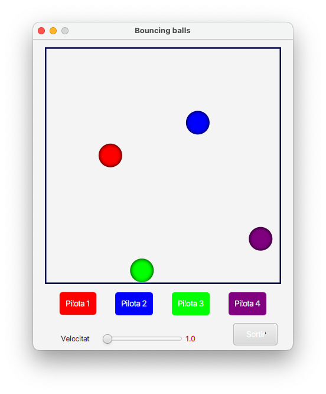
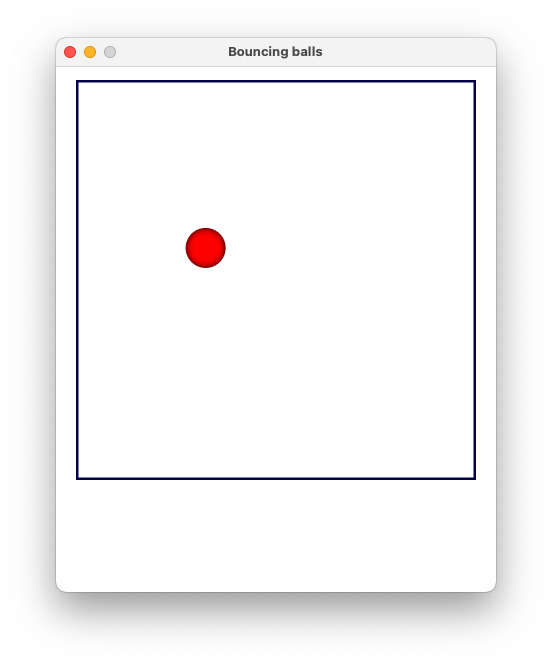

# Activitat 3: *Bouncing balls*

## Objectiu
Desenvolupar una aplicació JavaFX que permeti reforçar la gestió d'execució i aturada selectiva de fils. L'aplicació simularà pilotes que reboten dins d'un rectangle, amb controls per pausar i reprendre el moviment de cada pilota, així com modificar la velocitat de totes elles.
S'ha de contemplar el disseny _Thread-Safe_ per garantir la seguretat.

## Funcionament

### Fitxer `src/main/resources/main-view.fxml`

Afegim components en el fitxer FXML
- Botóns per afegir cada pilota.
  - `bt_pilota1` (Color "RED")
  - `bt_pilota2` (Color "BLUE")
  - `bt_pilota3` (Color "GREEN")
  - `bt_pilota4` (Color "PURPLE")
- Botó `bt_exit`, per parar totes les pilotes de cop. (Aquesta funció atura tots els Threads de les pilotes executades mitjançant els botóns anteriors.)
- Slider `sl_velocitat`, per modificar la velocitat total de les pilotes (Threads) que s'estan executant.

Exemple:


Codi:
```fxml

<?xml version="1.0" encoding="UTF-8"?>

<?import javafx.geometry.Insets?>
<?import javafx.scene.control.Button?>
<?import javafx.scene.control.Label?>
<?import javafx.scene.control.Slider?>
<?import javafx.scene.effect.InnerShadow?>
<?import javafx.scene.layout.AnchorPane?>
<?import javafx.scene.layout.Pane?>
<?import javafx.scene.text.Font?>

<AnchorPane prefHeight="515.0" prefWidth="440.0" xmlns="http://javafx.com/javafx/21" xmlns:fx="http://javafx.com/fxml/1" fx:controller="cat.dam.psp.ex3pilotesrebotones.controller.MainViewController">
    <Pane fx:id="pilotaPane" layoutX="20.0" layoutY="14.0" prefHeight="400.0" prefWidth="400.0" style="-fx-border-color: BLUE; -fx-border-width: 2.5;">
        <effect>
            <InnerShadow />
        </effect>
    </Pane>
   <Button fx:id="bt_pilota1" layoutX="54.0" layoutY="434.0" mnemonicParsing="false" prefHeight="30.0" prefWidth="70.0" style="-fx-background-color: RED;" text="Pilota 1" textFill="WHITE">
      <font>
         <Font name="Calibri" size="15.0" />
      </font>
   </Button>
   <Button fx:id="bt_pilota2" layoutX="144.0" layoutY="434.0" mnemonicParsing="false" prefHeight="30.0" prefWidth="70.0" style="-fx-background-color: BLUE;" text="Pilota 2" textFill="WHITE">
      <font>
         <Font name="Calibri" size="15.0" />
      </font>
   </Button>
   <Button fx:id="bt_pilota3" layoutX="233.0" layoutY="434.0" mnemonicParsing="false" prefHeight="30.0" prefWidth="70.0" style="-fx-background-color: GREEN;" text="Pilota 3" textFill="WHITE">
      <font>
         <Font name="Calibri" size="15.0" />
      </font>
   </Button>
   <Button fx:id="bt_pilota4" layoutX="320.0" layoutY="434.0" mnemonicParsing="false" prefHeight="30.0" prefWidth="70.0" style="-fx-background-color: PURPLE;" text="Pilota 4" textFill="WHITE">
      <font>
         <Font name="Calibri" size="15.0" />
      </font>
   </Button>
   <Button fx:id="bt_exit" layoutX="360.0" layoutY="481.0" mnemonicParsing="false" onAction="#onClickButtonExit" prefHeight="30.0" prefWidth="60.0" text="EXIT">
      <font>
         <Font name="Calibri" size="15.0" />
      </font>
   </Button>
   <Slider fx:id="sl_velocitat" layoutX="93.0" layoutY="496.0" />
   <Label layoutX="25.0" layoutY="493.0" text="Velocitat">
      <font>
         <Font name="Calibri" size="15.0" />
      </font>
   </Label>
   <Label fx:id="lb_velocitat" layoutX="236.0" layoutY="492.0" prefHeight="14.0" prefWidth="31.0" text="0.0" textFill="RED">
      <font>
         <Font name="Calibri" size="15.0" />
      </font>
   </Label>
    <opaqueInsets>
        <Insets bottom="10.0" left="10.0" right="10.0" top="10.0" />
    </opaqueInsets>
    <padding>
        <Insets bottom="10.0" left="10.0" right="10.0" top="10.0" />
    </padding>
</AnchorPane>

```

---

### Fitxer `src/main/java/cat.dam.psp.ex3pilotesrebotones/MainView.java`

Mantenim l'arxiu per defecte MainView proporcionat en el projecte Base.

Principalment, s'inicia l'arxiu fxml de manera visual, indicant la mida del programa, el titol i els controladors que s'executin perquè pugui funcionar correctament el programa (botóns, slider, pane, etc.).

Codi:
```java

// Códi sense importacións

public class MainView extends Application {

    @Override
    public void start(Stage stage) throws IOException {
        FXMLLoader loader = new FXMLLoader(MainView.class.getResource("main-view.fxml"));
        Scene scene = new Scene(loader.load(), 440, 526);
        MainViewController controller = loader.getController(); // Obtenim el controlador. Sempre desprès de load()
        stage.setResizable(false);
        stage.setTitle("Bouncing balls");
        stage.setScene(scene);
        stage.show();
    }

    public static void main(String[] args) {
        launch(args);
    }
}

```
---

### Fitxer `src/main/java/cat.dam.psp.ex3pilotesrebotones/controller/MainViewController.java`

Principalment en l'exemple proporcionat:

De manera inicial executa un fil que inicia el pane situat en el fitxer FXML amb la mida d'altura i amplada. 

Seguit afegeix una pilota en el Pane del fitxer FXML, com a fill del pane, indicant el color i el radius (mida de la pilota).
- Aquesta pilota és un Fil que s'executa de manera asíncrona.

```java

public class MainViewController {
    @FXML
    private Pane pilotaPane;

    private static final int DEFAULT_RADIUS = 20;

    // Inicialitza el controlador de pilotes
    public void initialize() {
        PilotaController pilotaController = new PilotaController(pilotaPane, pilotaPane.getPrefWidth(), pilotaPane.getPrefHeight());
        pilotaController.addPilota(Color.RED, DEFAULT_RADIUS);
    }
}


```

S'ha modificat el fitxer MainViewController afegint tots els botóns i sliders indicats en el FXML, i fent un array dels botóns i un altre dels colors (per evitar duplicar codi per a cada botó).

- Indiquem a la funció `initialize()` que s'iniciïn l'array dels botóns, que comprovi que el pane no sigui null, és a dir que comprovi que s'està executant correctament i no hi hagi un problema.

- Afegim funcions per simplificar códi com:
  - `addPilota(String color)`
    - Afegeix el fil d'una pilota filtrant per color.
  - `removePilota(Color color)`
    - Pausa el fil de la pilota filtrant per color, indicant pilota.running com a false. (Variable booleana indicada en el fitxer Pilota)
  - `resumePilota(Color color)`
    - Reprèn el fil de la pilota filtrant per color, indicant pilota.running com a true, si està indicat com a false anteriorment. (Variable booleana indicada en el fitxer Pilota)

- Afegim la funció `initButtons()`, que permet iniciar cada botó utilitzant un array i indicant el color de background corresponent per a cada botó en el moment que sigui clicat.

- Seguit hem afegit la funció `onClickButtonPilota(Button button, Color color)`, on indiquem el botó clicat i el color de cada fil (pilota), fem filtatje de botóns i indiquem la funció, variant les funcions `addPilota`, `removePilota` i `resumePilota`.

- Funcio `onClickButtonExit()`, aquesta funció pausa tots els fils (pilotes) que s'estiguin executant i s'aturen directament.

- Funció `velocitatPilota(double velocitat)`, aquesta funció serveix per afegir la velocitat indicada en la funció `onSlideVelocity()` a tots els fils (pilotes) que s'estiguin executant, és a dir que no siguin null.

- Funció `onSlideVelocity()`, indica el valor minim, máxim i per defecte indicat quan s'inicia el FXML un cop obert el programa.
   - Seguit, aquesta funció afegeix el valor indicat a la funció `velocitatPilota(double velocitat)`. 


Codi:

```java

public class MainViewController {
    @FXML
    private Pane pilotaPane;
    @FXML
    private Button[] buttons;
    @FXML
    private Button bt_exit;
    @FXML
    private Label lb_velocitat;
    @FXML
    private Slider sl_velocitat;

    private static final int DEFAULT_RADIUS = 20;
    private static final Color [] colors = {Color.RED, Color.BLUE, Color.GREEN, Color.PURPLE};
    PilotaController pilotaController;
    @FXML
    private Button bt_pilota1;
    @FXML
    private Button bt_pilota2;
    @FXML
    private Button bt_pilota3;
    @FXML
    private Button bt_pilota4;

    // Inicializa el controlador de pilotes
    public void initialize() {
        buttons = new Button[]{bt_pilota1, bt_pilota2, bt_pilota3, bt_pilota4};
        initButtons();

        if (pilotaPane != null) {
            pilotaController = new PilotaController(pilotaPane, pilotaPane.getPrefWidth(), pilotaPane.getPrefHeight());
            onSlideVelocity();
        } else {
            System.out.println("Error: pilotaPane no s'ha inicialitzat.");
        }
    }

    private void initButtons() {
        for (int i = 0; i < buttons.length; i++) {
            Button button = buttons[i];
            button.setBackground(new Background(new BackgroundFill(colors[i], null, null)));
            int finalI = i;
            button.setOnAction(e -> onClickButtonPilota(button, colors[finalI]));
        }
    }

    public void addPilota(String color) {
        if (PilotaController.findPilota(Color.valueOf(color)) == null) {
            pilotaController.addPilota(Color.valueOf(color), DEFAULT_RADIUS);
        } else {
            pilotaController.resumePilota(Color.valueOf(color));
        }
    }

    public void removePilota(Color color) {
        pilotaController.stopPilota(color);
    }

    public void resumePilota(Color color) {
        pilotaController.resumePilota(color);
    }

    public double velocitatPilota(double velocitat) {
        PilotaController.pane.getChildren().forEach(
                node -> {
                    if (node instanceof Pilota) {
                        Pilota.velocitat = velocitat;
                    }
                }
        );
        return velocitat;
    }

    public void onClickButtonPilota(Button button, Color color) {
        if (button == bt_exit) {
            onClickButtonExit();
            return;
        }

        if (PilotaController.findPilota(color) != null) {
            if (Objects.requireNonNull(PilotaController.findPilota(color)).running) {
                removePilota(color);
            } else {
                resumePilota(color);
            }
        } else {
            addPilota(color.toString());
        }
    }

    public void onClickButtonExit() {
        for(int i = 0; i < buttons.length; i++) {
            if (PilotaController.findPilota(colors[i]) != null)
                removePilota(Color.valueOf(colors[i].toString()));
        }
    }

    public void onSlideVelocity() {
        sl_velocitat.setMin(1);
        sl_velocitat.setMax(10);
        sl_velocitat.setValue(velocitatPilota(Pilota.velocitat));
        sl_velocitat.valueProperty().addListener((observable, oldValue, newValue) -> {
            lb_velocitat.setText(String.format(String.valueOf(newValue.doubleValue()), "%.1f"));
            velocitatPilota(newValue.doubleValue());
        });
    }
}

```

---

### Fitxer `src/main/java/cat.dam.psp.ex3pilotesrebotones/classes/Pilota.java`

Fitxer per defecte, sense modificar utilitzat a l'explicació principal del programa.

```java

public class Pilota extends Circle implements Runnable {
    private double dx, dy;  // Direccions de moviment
    private final double limitX, limitY;  // Límits de l'àrea de moviment
    public volatile boolean running = true;  // Controla si la pilota està en moviment
    public static double velocitat = 1.0;  // Velocitat comuna a totes les pilotes

    public Pilota(Color color, int radius, double limitX, double limitY) {
        super(radius, color);  // És filla de Circle. Li facilitem el color i el radi
        this.limitX = limitX;  // Límit dels eixos X i Y
        this.limitY = limitY;
        this.dx = 1 + Math.random() * 3;  // Velocitat inicial aleatòria en l'eix X
        this.dy = 1 + Math.random() * 3;  // Velocitat inicial aleatòria en l'eix Y
        // Posiciona la pilota en un lloc aleatori dins dels límits
        setLayoutX(radius + Math.random() * (limitX - 2 * radius));
        setLayoutY(radius + Math.random() * (limitY - 2 * radius));
    }

    @Override
    public void run() {
        while (running) {
            double x = getLayoutX() + dx * velocitat;
            double y = getLayoutY() + dy * velocitat;

            if (x <= getRadius() || x >= limitX - getRadius()) {
                dx *= -1;
            }
            if (y <= getRadius() || y >= limitY - getRadius()) {
                dy *= -1;
            }

            // Actualitza la posició de la pilota en el thread principal d'aplicació de JavaFX
            Platform.runLater(() -> {
                setLayoutX(x);
                setLayoutY(y);
            });

            // Introna un retard per la velocitat de la pilota. Així la veurem millor
            try {
                Thread.sleep(20);
            } catch (InterruptedException e) {
                running = false;
            }
        }
    }
}

```

--- 

### Fitxer `src/main/java/cat.dam.psp.ex3pilotesrebotones/controller/PilotaController.java`

Principalment el fitxer afegeix la pilota.

Codi original:
```java

public class PilotaController {
    private final Pane pane;
    private final double limitX, limitY;

    public PilotaController(Pane pane, double limitX, double limitY) {
        this.pane = pane;
        this.limitX = limitX;
        this.limitY = limitY;
    }

    public void addPilota(Color color, int radius) {
        Pilota pilota = new Pilota(color, radius, limitX, limitY);
        pane.getChildren().add(pilota);
        new Thread(pilota).start();
    }
}

```

Seguit actualitzem el códi afegint les funcions iniciades anteriorment en el fitxer `MainViewController.java`:
- `findPilota(Color color)`
- `stopPilota(Color color)`
  - Indiquem la variable pilota.running a false perquè s'aturi el fil (pilota).
- `resumePilota(Color color)`
  - Indiquem la variable pilota.running a true perquè s'aturi el fil (pilota).
  - Indiquem start al fil de la pilota utilitzant `new Thread(pilota).start()`.

Codi:

```java

public class PilotaController {
    protected static Pane pane = new Pane();
    private final double limitX, limitY;

    public PilotaController(Pane pane, double limitX, double limitY) {
        PilotaController.pane = pane;
        this.limitX = limitX;
        this.limitY = limitY;
    }

    public static Pilota findPilota(Color color) {
        for (Node node : pane.getChildren()) {
            if (node instanceof Pilota && ((Pilota) node).getFill().equals(color)) {
                return (Pilota) node;
            }
        }
        return null;
    }

    public void addPilota(Color color, int radius) {
        Pilota pilota = new Pilota(color, radius, limitX, limitY);
        pane.getChildren().add(pilota);
        new Thread(pilota).start();
    }


    public void stopPilota(Color color) {
        Pilota pilota = PilotaController.findPilota(color);
        pilota.running = false;
    }


    public void resumePilota(Color color) {
        Pilota pilota = PilotaController.findPilota(color);
        pilota.running = true;
        new Thread(pilota).start();
    }
}

```

## Descripció

**Funcionalitats de l'aplicació:**

1. **Interfície d'usuari amb JavaFX (FXML):** La interfície inclourà un rectangle on les pilotes rebotaran, botons per controlar les pilotes i un botó de sortida.

2. **Controls de l'usuari:**
   - Quatre botons, cadascun corresponent a una pilota, per iniciar o aturar el seu moviment (boto 1 vermell, boto 2 verd, boto 3 blau, boto 4 morat, per exemple).
   - Un control [slider](https://www.geeksforgeeks.org/javafx-slider-class/) que permetrà augmentar la velocitat de totes les pilotes alhora.
   - Un botó "Sortir" que permeti tancar l'aplicació de manera segura.

3. **Pilotes animades:**
   - Un màxim de **4** pilotes, cadascuna controlada per un **fil separat**.
   - Cada pilota començarà amb un color assignat (vermell, verd, blau, morat, per exemple). El color coincidirà amb els botons per identificar fàcilment quin botó controla una pilota.

4. **Velocitat de les pilotes:**
   - El control slider permetrà ajustar la velocitat de totes les pilotes.

5. **Estil CSS:**
   - Aplicació d'estils CSS per a una interfície d'usuari atractiva.

#### Requisits tècnics

- L'aplicació ha de ser desenvolupada utilitzant JavaFX amb JDK >= 11.
- El disseny de la interfície d'usuari s'ha de realitzar amb un fitxer FXML.
- L'estil de la interfície d'usuari s'ha de definir amb un fitxer CSS.
- La gestió de fils ha de ser precisa per evitar condicions de cursa i assegurar una sortida neta de l'aplicació.

#### Objectius d'aprenentatge

- Entendre i aplicar la creació i gestió de fils en Java.
- Integrar JavaFX amb la programació multithread per crear animacions interactives.
- Practicar la utilització de FXML i CSS per a dissenyar interfícies d'usuari en JavaFX.
- Comprendre la importància de la gestió segura de fils en el tancament d'aplicacions.

## Plantilla a refactoritzar

Disposes d'una plantilla bàsica que pots o no utilitzar per desenvolupar la teva proposta. Aquesta conté **errors** i **no** segueix les directrius d'un disseny _**Thread-Safe**_.
Utilitza-la, si vols, per tenir una base i poder-te centrar en la gestió del fils, que és l'objectiu de l'activitat.

Si l'executes obtindràs aquesta 'sortida':




## Exemple d'aplicació final

Un exemple d'aplicació podria ser:


En funcionament ...

[act_3_bouncing_balls_demo.mov](act_3_bouncing_balls_demo.mov)

## CODI D’HONOR

_L'ús de la IA ha de ser una eina d'aprenentatge i millora personal, no una forma de
trampa que minvi el teu progrés, comprensió dels conceptes i capacitat d'assolir reptes
més complexos._

* **Autenticitat en l'aprenentatge**. _Utilitza la intel·ligència artificial per entendre els problemes
i desenvolupar les teves habilitats, no per evadir els reptes d'aprenentatge._
* **Col·laboració ètica**. _Col·labora amb altres estudiants de manera ètica i transparent. Ajuda'ls
a comprendre i superar els obstacles, però no els donis solucions completes si això
compromet la seva pròpia comprensió._
* **Reconeixement dels recursos**. _Si utilitzes codi, solucions o materials d'altres fonts,
assegura't de reconèixer i citar adequadament aquests recursos. L’honestedat intel·lectual
és fonamental._
* **Responsabilitat personal**. _La responsabilitat del teu aprenentatge i èxit recau en tu mateix.
Utilitza les eines d'intel·ligència artificial com a suport, no com a substitut de l'esforç._