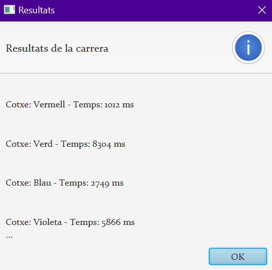

# Activitat 4: _GT Racing Cars_

## Descripción General

El proyecto se divide en varias clases y archivos FXML para modularizar y organizar el código de manera efectiva. A continuación, se describen las principales clases y archivos del proyecto:

## Objectiu
Desenvolupar una aplicació JavaFX que simuli una carrera de cotxes, on cada cotxe és controlat per un fil separat. L'usuari podrà iniciar, pausar i reprendre la carrera, així com veure els resultats de la carrera una vegada finalitzi.



### RacingCarsApp.java

```java
package cat.dam.psp.ex4racingcars;

import javafx.application.Application;
import javafx.fxml.FXMLLoader;
import javafx.scene.Scene;
import javafx.stage.Stage;

public class RacingCarsApp extends Application {
    @Override
    public void start(Stage stage) throws Exception {
        FXMLLoader loader = new FXMLLoader(RacingCarsApp.class.getResource("carrera-view.fxml"));
        Scene scene = new Scene(loader.load());
        stage.setResizable(false);
        stage.setTitle("GT Racing Cars");
        stage.setScene(scene);
        stage.show();
    }

    public static void main(String[] args) {
        launch(args);
    }
}
```

La clase principal `RacingCarsApp` inicia la aplicación y carga la interfaz gráfica desde el archivo FXML.

### CarreraViewController.java

```java
package cat.dam.psp.ex4racingcars.controller;

import cat.dam.psp.ex4racingcars.classes.CarreraController;
import cat.dam.psp.ex4racingcars.classes.Cotxe;
import javafx.fxml.FXML;
import javafx.fxml.Initializable;
import javafx.scene.control.Button;
import javafx.scene.layout.Pane;

import java.net.URL;
import java.util.ResourceBundle;

public class CarreraViewController implements Initializable {
    public Button btnIniciar;
    public Button btnPausar;
    public Button btnReprendre;
    public Button btnReiniciar;
    @FXML
    private Pane pistaCarrera;

    private CarreraController carreraController;
    private final int limitX = 600; // L'ample de la pista de carrera
    private final int ampladaCarril = 75; // L'alçada de cada carril

    @Override
    public void initialize(URL url, ResourceBundle resourceBundle) {
        carreraController = new CarreraController(pistaCarrera, limitX, ampladaCarril);
    }

    @FXML
    private void handleIniciar() {
        carreraController.iniciarCarrera();
        //throw new UnsupportedOperationException();
    }

    @FXML
    private void handlePausar() {
        carreraController.pausarCarrera();
    }

    @FXML
    private void handleReprendre() {
        carreraController.continuarCarrera();
    }

    @FXML
    private void handleReiniciar() {
        carreraController.reiniciarCarrera();
        carreraController = new CarreraController(pistaCarrera, limitX, ampladaCarril);
    }

    @FXML
    private void handleSortir() {
        carreraController.pausarCarrera();
        System.exit(0);
    }
}
```

Esta clase controla la lógica de la interfaz de usuario y las interacciones con el usuario. Implementa métodos para iniciar, pausar, reanudar, reiniciar y salir de la carrera.

### CarreraController.java

```java
package cat.dam.psp.ex4racingcars.classes;

import cat.dam.psp.ex4racingcars.controller.CarreraViewController;
import javafx.application.Platform;
import javafx.scene.control.Alert;
import javafx.scene.layout.Pane;
import javafx.scene.layout.Region;
import javafx.scene.paint.Color;

public class CarreraController {
    private int cochesFinalizados = 0;
    private final Pane pistaCarrera;
    private final int limitX;
    private final int ampladaCarril;
    private final double velocitatMaxima = 5.0; // Velocitat maxima del cotxe
    private ResultatCarrera[] resultats;
    private Cotxe cotxe;
    private Color[] colorsCotxes = {Color.RED, Color.GREEN, Color.BLUE, Color.PURPLE};
    public Cotxe[] cotxes = new Cotxe[4];

    public CarreraController(Pane pistaCarrera, int limitX, int ampladaCarril) {
        this.pistaCarrera = pistaCarrera;
        this.limitX = limitX;
        this.ampladaCarril = ampladaCarril;
        this.resultats = new ResultatCarrera[cotxes.length];
        for (int i = 0; i < cotxes.length; i++) {
            this.cotxe = new Cotxe(colorsCotxes[i], i * ampladaCarril, limitX, ampladaCarril, velocitatMaxima, this);
            cotxes[i] = this.cotxe;
            this.resultats[i] = new ResultatCarrera(this.cotxe.getColorCotxe(), 0); // Valor a modificar al final de la carrera
        }
        inicialitzarCotxes();
    }

    public void inicialitzarCotxes() {
        for (Cotxe cotxe : cotxes) {
            pistaCarrera.getChildren().add(cotxe);
        }
    }

    public void iniciarCarrera() {
        for (Cotxe cotxe : cotxes) {
            cotxe.tempsInici = System.currentTimeMillis();
            cotxe.enMoviment = true;
            new Thread(cotxe).start();
        }
    }

    public void pausarCarrera() {
        for (Cotxe cotxe : cotxes) {
            cotxe.enMoviment = false;
        }
    }

    public void continuarCarrera() {
        for (Cotxe cotxe : cotxes) {
            cotxe.enMoviment = true;
            new Thread(cotxe).start();
        }
    }

    public void reiniciarCarrera() {
        for (Cotxe cotxe : cotxes) {
            pistaCarrera.getChildren().remove(cotxe);
        }
        for (ResultatCarrera resultat : resultats) {
            pistaCarrera.getChildren().remove(resultat);
        }
    }


    public void notificarFinalCarrera(Cotxe cotxe) {
        int index = getCotxeIndex(cotxe);
        this.resultats[index] = new ResultatCarrera(cotxe.getColorCotxe(), cotxe.tempsFinal);

        cochesFinalizados++;

        if (cochesFinalizados == cotxes.length) {
            Platform.runLater(() -> {
                // Todos los coches han finalizado, mostrar el Alert
                mostrarResultats(resultats);
                cochesFinalizados = 0; // Reinicia el contador para la próxima carrera
                reiniciarCarrera();
                new CarreraController(this.pistaCarrera, this.limitX, this.ampladaCarril);
            });
        }

    }


    // Nou mètode para obtenir l'índex del cotxe
    private int getCotxeIndex(Cotxe cotxe) {
        for (int i = 0; i < cotxes.length; i++) {
            if (cotxes[i] == cotxe) {
                return i;
            }
        }
        return -1;
    }


    private void mostrarResultats(ResultatCarrera[] resultats) {
        Alert alert = new Alert(Alert.AlertType.INFORMATION);
        alert.setTitle("Resultats");
        alert.setHeaderText("Resultats de la carrera");
        alert.initOwner(pistaCarrera.getScene().getWindow());
        alert.getDialogPane().setPrefSize(Region.USE_COMPUTED_SIZE, Region.USE_COMPUTED_SIZE);
        alert.getDialogPane().setPrefWidth(Region.USE_COMPUTED_SIZE);
        alert.getDialogPane().setPrefHeight(Region.USE_COMPUTED_SIZE);
        alert.getDialogPane().setMinWidth(Region.USE_COMPUTED_SIZE);
        alert.getDialogPane().setMinHeight(Region.USE_COMPUTED_SIZE);


        StringBuilder contentText = new StringBuilder();
        for (ResultatCarrera resultat : resultats) {
            contentText.append(resultat.toString()).append("\n");
        }

        alert.setContentText(contentText.toString());
        alert.showAndWait();
    }
}
```

Gestiona la lógica de la carrera, inicializa los coches, notifica cuando un coche ha finalizado y muestra los resultados al finalizar la carrera.

### Cotxe.java

```java
package cat.dam.psp.ex4racingcars.classes;

import javafx.application.Platform;
import javafx.scene.paint.Color;
import javafx.scene.shape.Rectangle;


public class Cotxe extends Rectangle implements Runnable {
    public volatile boolean enMoviment;
    private final double velocitatMaxima;
    private double velocitatActual;
    private final double carrilY;
    private final int limitX;
    private final int ampladaCarril;
    public long tempsInici;
    public long tempsFinal;
    private final Color colorCotxe;
    private final CarreraController carreraController;
    private static final int VELOCITAT_REFRESC = 5;

    public Cotxe(Color color, double carrilY, int limitX, int ampladaCarril, double velocitatMaxima, CarreraController controller) {
        super(40, 20, color); // Mides del cotxe (amplada, altura)
        this.colorCotxe = color;
        this.carrilY = carrilY;
        this.limitX = limitX;
        this.ampladaCarril = ampladaCarril;
        this.velocitatMaxima = velocitatMaxima;
        this.velocitatActual = Math.random() * velocitatMaxima;
        this.carreraController = controller;
        setLayoutY(carrilY + (ampladaCarril - getHeight()) / 2); // Posicionament vertical dins del carril
    }

    @Override
    public void run() {
        while (enMoviment && !arribatAMeta()) {
            double x = getLayoutX() + velocitatActual;
            Platform.runLater(() -> setLayoutX(x));
            try {
                Thread.sleep(VELOCITAT_REFRESC); // Interval de temps per a l'actualització del moviment
            } catch (InterruptedException e) {
                Thread.currentThread().interrupt();
                enMoviment = false;
            }
        }
        if (enMoviment) {
            tempsFinal = System.currentTimeMillis() - tempsInici;
            enMoviment = false;
            carreraController.notificarFinalCarrera(this);
        }
    }

    private boolean arribatAMeta() {
        return getLayoutX() >= limitX - getWidth();
    }

    public Color getColorCotxe() {
        return colorCotxe;
    }

    public void canviarVelocitat(double novaVelocitat) {
        this.velocitatActual = Math.min(novaVelocitat, velocitatMaxima);
    }
}
```

Representa un coche en la carrera, con métodos para cambiar la velocidad y controlar su movimiento.

### ResultatCarrera.java

```java
package cat.dam.psp.ex4racingcars.classes;

import javafx.scene.Node;
import javafx.scene.paint.Color;
import javafx.scene.paint.Paint;
import javafx.scene.shape.Rectangle;

import java.util.HashMap;
import java.util.Map;

public class ResultatCarrera extends Node implements Comparable<ResultatCarrera> {
    private Color colorCotxe;
    private long temps;

    public ResultatCarrera(Color colorCotxe, long temps) {
        this.colorCotxe = colorCotxe;
        this.temps = temps;
    }

    @Override
    public int compareTo(ResultatCarrera altre) {
        return Long.compare(this.temps, altre.temps);
    }

    @Override
    public String toString() {
        return String.format("\nCotxe: %s - Temps: %d ms\n", colorToString(colorCotxe), temps);
    }

    private static final Map<Color, String> COLOR_NAMES = new HashMap<>();
    static {
        COLOR_NAMES.put(Color.RED, "Vermell");
        COLOR_NAMES.put(Color.GREEN, "Verd");
        COLOR_NAMES.put(Color.BLUE, "Blau");
        COLOR_NAMES.put(Color.PURPLE, "Violeta");
    }

    private String colorToString(Color color) {
        return COLOR_NAMES.getOrDefault(color, "Desconegut");
    }

    @Override
    public Node getStyleableNode() {
        return super.getStyleableNode();
    }
}
```

Este archivo define la clase `ResultatCarrera`, encargada de almacenar y presentar los resultados de la carrera. La implementación incluye la comparación de resultados y la representación en formato de cadena para mostrar el color del coche y el tiempo empleado en la carrera.

Este proyecto proporciona una experiencia interactiva de carreras de coches utilizando Java y JavaFX. Se ha estructurado de manera modular, con diferentes clases para gestionar la interfaz gráfica, la lógica de la carrera y la representación de los coches y resultados. La interfaz `CarreraViewController` permite al usuario controlar el desarrollo de la carrera, mientras que la clase `CarreraController` gestiona la lógica de la competición.

### Destacados

- **CarreraViewController.java**: Controla la lógica de la interfaz de usuario y las interacciones con el usuario. Implementa métodos para iniciar, pausar, reanudar, reiniciar y salir de la carrera.

- **CarreraController.java**: Gestiona la lógica de la carrera, inicializa los coches, notifica cuando un coche ha finalizado y muestra los resultados al finalizar la carrera.

- **Cotxe.java**: Representa un coche en la carrera, con métodos para cambiar la velocidad y controlar su movimiento.

- **ResultatCarrera.java**: Almacena y presenta los resultados de la carrera, mostrando el tiempo que ha tardado cada coche en llegar a la meta.

Este proyecto es una muestra de desarrollo de aplicaciones gráficas y simulaciones en Java, ofreciendo una experiencia interactiva de carreras de coches. ¡Diviértete explorando y mejorando este proyecto!


### Descripció

**Funcionalitats de l'aplicació:**

1. **Interfície d'usuari amb JavaFX:**
   - Dissenyar una interfície gràfica que representi una pista de carrera amb diverses carrils.
   - Cada carril representarà un cotxe en la carrera.

2. **Control de la carrera:**
   - Implementar botons per iniciar, pausar i reprendre la carrera.
   - Incloure un botó per reiniciar la carrera i tornar a començar des de zero.
   - Incloure un botó per sortir de l'aplicació de manera segura.
   - El control dels botons ha de ser ajustat a les condicions de carrera, per exemple: si l'usuari inicia la carrera, el botó Iniciar es desactivarà. 

3. **Cotxes:**
   - Crear una classe `Cotxe` que serà controlada per un fil. Cada cotxe tindrà la seva velocitat i posició dins del carril.
   - La velocitat dels cotxes serà determinada aleatòriament, simulant una competició real.

4. **Visualització de resultats:** 
   - Al finalitzar la carrera, mostrar els resultats en una taula de classificació.
   - No cal una nova finestra. Consulta la classe [Alert](https://code.makery.ch/blog/javafx-dialogs-official/).

#### Requisits tècnics

- Utilitzar JavaFX amb JDK >= 11 per a la interfície d'usuari.
- Implementar la lògica de moviment dels cotxes dins de fils separats.
- Assegurar una correcta sincronització per iniciar, pausar i aturar els fils dels cotxes.
- Gestionar correctament la finalització dels fils quan l'usuari tanca l'aplicació.

#### Objectius d'aprenentatge

- Practicar la creació i gestió de fils en un entorn JavaFX.
- Entendre com sincronitzar fils per a tasques comunes en una aplicació gràfica.
- Desenvolupar habilitats per a la creació d'interfícies d'usuari interactives i dinàmiques amb JavaFX.

## Plantilla a refactoritzar

Disposes d'una plantilla bàsica que pots o no utilitzar per desenvolupar la teva proposta. Aquesta conté errors i no segueix les directrius d'un disseny Thread-Safe.
Utilitza-la, si vols, per tenir una base i poder-te centrar en la gestió del fils, que és l'objectiu de l'activitat.

Si l'executes obtindràs aquesta 'sortida':


## Exemple d'aplicació final

Una proposta d'aplicació final podria ser:


En funcionament ...


## CODI D’HONOR

_L'ús de la IA ha de ser una eina d'aprenentatge i millora personal, no una forma de
trampa que minvi el teu progrés, comprensió dels conceptes i capacitat d'assolir reptes
més complexos._

* **Autenticitat en l'aprenentatge**. _Utilitza la intel·ligència artificial per entendre els problemes
i desenvolupar les teves habilitats, no per evadir els reptes d'aprenentatge._
* **Col·laboració ètica**. _Col·labora amb altres estudiants de manera ètica i transparent. Ajuda'ls
a comprendre i superar els obstacles, però no els donis solucions completes si això
compromet la seva pròpia comprensió._
* **Reconeixement dels recursos**. _Si utilitzes codi, solucions o materials d'altres fonts,
assegura't de reconèixer i citar adequadament aquests recursos. L’honestedat intel·lectual
és fonamental._
* **Responsabilitat personal**. _La responsabilitat del teu aprenentatge i èxit recau en tu mateix.
Utilitza les eines d'intel·ligència artificial com a suport, no com a substitut de l'esforç._