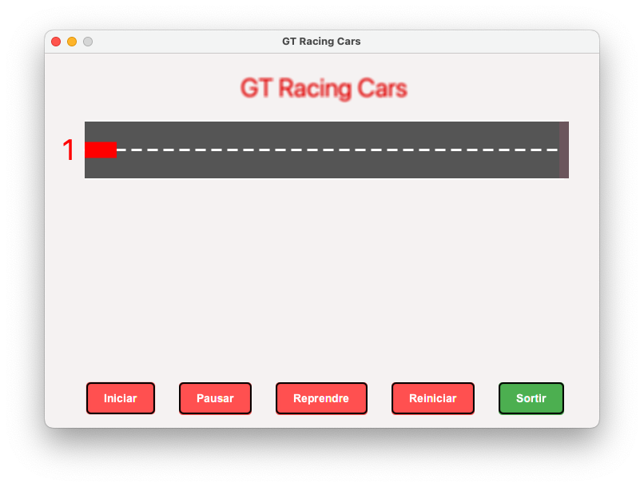
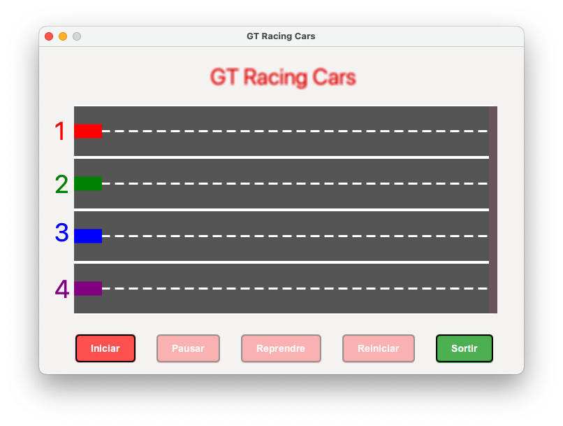

# Activitat 4: _GT Racing Cars_

## Objectiu
Desenvolupar una aplicació JavaFX que simuli una carrera de cotxes, on cada cotxe és controlat per un fil separat. L'usuari podrà iniciar, pausar i reprendre la carrera, així com veure els resultats de la carrera una vegada finalitzi.

### Descripció

**Funcionalitats de l'aplicació:**

1. **Interfície d'usuari amb JavaFX:**
   - Dissenyar una interfície gràfica que representi una pista de carrera amb diverses carrils.
   - Cada carril representarà un cotxe en la carrera.

2. **Control de la carrera:**
   - Implementar botons per iniciar, pausar i reprendre la carrera.
   - Incloure un botó per reiniciar la carrera i tornar a començar des de zero.
   - Incloure un botó per sortir de l'aplicació de manera segura.
   - El control dels botons ha de ser ajustat a les condicions de carrera, per exemple: si l'usuari inicia la carrera, el botó Iniciar es desactivarà. 

3. **Cotxes:**
   - Crear una classe `Cotxe` que serà controlada per un fil. Cada cotxe tindrà la seva velocitat i posició dins del carril.
   - La velocitat dels cotxes serà determinada aleatòriament, simulant una competició real.

4. **Visualització de resultats:** 
   - Al finalitzar la carrera, mostrar els resultats en una taula de classificació.
   - No cal una nova finestra. Consulta la classe [Alert](https://code.makery.ch/blog/javafx-dialogs-official/).

#### Requisits tècnics

- Utilitzar JavaFX amb JDK >= 11 per a la interfície d'usuari.
- Implementar la lògica de moviment dels cotxes dins de fils separats.
- Assegurar una correcta sincronització per iniciar, pausar i aturar els fils dels cotxes.
- Gestionar correctament la finalització dels fils quan l'usuari tanca l'aplicació.

#### Objectius d'aprenentatge

- Practicar la creació i gestió de fils en un entorn JavaFX.
- Entendre com sincronitzar fils per a tasques comunes en una aplicació gràfica.
- Desenvolupar habilitats per a la creació d'interfícies d'usuari interactives i dinàmiques amb JavaFX.

## Plantilla a refactoritzar

Disposes d'una plantilla bàsica que pots o no utilitzar per desenvolupar la teva proposta. Aquesta conté errors i no segueix les directrius d'un disseny Thread-Safe.
Utilitza-la, si vols, per tenir una base i poder-te centrar en la gestió del fils, que és l'objectiu de l'activitat.

Si l'executes obtindràs aquesta 'sortida':

{width 32%}

## Exemple d'aplicació final

Una proposta d'aplicació final podria ser:

{width 32%}

En funcionament ...

## CODI D’HONOR

_L'ús de la IA ha de ser una eina d'aprenentatge i millora personal, no una forma de
trampa que minvi el teu progrés, comprensió dels conceptes i capacitat d'assolir reptes
més complexos._

* **Autenticitat en l'aprenentatge**. _Utilitza la intel·ligència artificial per entendre els problemes
i desenvolupar les teves habilitats, no per evadir els reptes d'aprenentatge._
* **Col·laboració ètica**. _Col·labora amb altres estudiants de manera ètica i transparent. Ajuda'ls
a comprendre i superar els obstacles, però no els donis solucions completes si això
compromet la seva pròpia comprensió._
* **Reconeixement dels recursos**. _Si utilitzes codi, solucions o materials d'altres fonts,
assegura't de reconèixer i citar adequadament aquests recursos. L’honestedat intel·lectual
és fonamental._
* **Responsabilitat personal**. _La responsabilitat del teu aprenentatge i èxit recau en tu mateix.
Utilitza les eines d'intel·ligència artificial com a suport, no com a substitut de l'esforç._