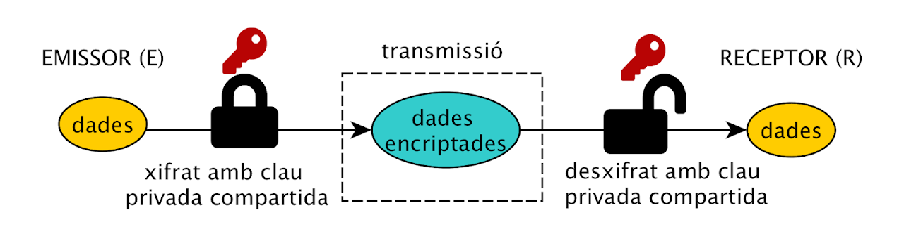

# Criptografia

[TOC]

## Introducció
La criptografia és l'art i la ciència de protegir la informació mitjançant tècniques de codificació. La criptografia ha estat una eina crucial per a la comunicació segura i la protecció de la informació al llarg de la història.

### Història de la Criptografia
La criptografia té arrels antigues, amb els primers exemples coneguts que daten del 1900 aC en l'antic Egipte. Al llarg de la història, la criptografia ha evolucionat de manera significativa:

- **Criptografia Clàssica (fins al segle XIX)**: Inicialment es van utilitzar mètodes simples de substitució i transposició. Un exemple destacat és el xifrat de Cèsar, utilitzat per [Juli Cèsar](https://ca.wikipedia.org/wiki/Xifratge_de_C%C3%A8sar) per a comunicacions militars.

- **Criptografia Mecànica (segle XIX - principis del segle XX)**: Amb l'avènyiment de les màquines, la criptografia es va tornar més avançada. Un exemple és la màquina [Enigma](https://ca.wikipedia.org/wiki/M%C3%A0quina_Enigma) utilitzada durant la Segona Guerra Mundial.

- **Criptografia Moderna (mitjan segle XX - present)**: El desenvolupament de la teoria de la informació i l'arribada dels ordinadors van portar a mètodes criptogràfics més avançats. Aquesta era va veure el naixement de la criptografia de clau pública i privada, juntament amb moltes altres innovacions en criptografia simètrica i asimètrica.

La criptografia continua evolucionant amb l'avanç de la tecnologia, incloent l'arribada de la criptografia quàntica, que promet proporcionar seguretat contra les amenaces futures posades per les [computadores quàntiques](https://ca.wikipedia.org/wiki/Ordinador_qu%C3%A0ntic).

## Criptografia Simètrica

### Introducció
La criptografia simètrica és un tipus de criptografia on es fa servir la mateixa clau per a xifrar i desxifrar la informació. És una de les formes més antigues i més ràpides de criptografia, i s'utilitza àmpliament en situacions on la velocitat és una consideració crucial. Malgrat la seva eficiència, la criptografia simètrica presenta reptes, com ara la distribució segura de claus i l'escassetat de claus en escenaris de gran escala.

### Definició
La criptografia simètrica fa servir algoritmes que requereixen que tant l'emissor com el receptor tinguin accés a una única clau secreta. Alguns dels algoritmes simètrics més comuns inclouen AES (Advanced Encryption Standard), DES (Data Encryption Standard) i Triple DES.



En aquest diagrama:

1. L'Emissor (E) utilitza una **clau secreta** per a xifrar el missatge original o *text clar*.
2. La **clau secreta** proporciona el **text xifrat**.
3. L'Emissor **envia** el text xifrat al Receptor.
4. El **Receptor** utilitza l**a mateixa clau decreta** per a desxifrar el text xifrat.
5. La **clau secreta** proporciona el text **desxifrat** (el missatge original), al Receptor.

### Algorismes més habituals de xifratge simètric

#### 1. **[AES (Advanced Encryption Standard)](https://ca.wikipedia.org/wiki/Advanced_Encryption_Standard)**:
   - **Descripció**: AES és un estàndard de xifratge adoptat pel govern dels EUA. És un algoritme de bloc que xifra les dades en blocs de 128 bits, amb claus de 128, 192 o 256 bits.
   - **Exemple**:
```java
   import javax.crypto.Cipher;
   import javax.crypto.spec.SecretKeySpec;
   import java.util.Base64;

   public class ExempleAES {
       public static void main(String[] args) throws Exception {
           String clau = "clau_secreta_aes";  // Asegura't que la clau és de 16 caràcters (128 bits)
           SecretKeySpec secretKey = new SecretKeySpec(clau.getBytes(), "AES");

           Cipher cipher = Cipher.getInstance("AES");
           cipher.init(Cipher.ENCRYPT_MODE, secretKey);
           byte[] textXifrat = cipher.doFinal("Text secret".getBytes());
           System.out.println("Text xifrat: " + Base64.getEncoder().encodeToString(textXifrat));

           cipher.init(Cipher.DECRYPT_MODE, secretKey);
           byte[] textDesxifrat = cipher.doFinal(textXifrat);
           System.out.println("Text desxifrat: " + new String(textDesxifrat));
       }
   }
```

#### 2. **[DES (Data Encryption Standard)](https://ca.wikipedia.org/wiki/DES)**:
   - **Descripció**: DES és un algoritme de xifratge de bloc que va ser l'estàndard de xifratge anterior a AES. Xifra les dades en blocs de 64 bits amb una clau de 56 bits.
   - **Exemple**:
```java
import javax.crypto.Cipher;
import javax.crypto.spec.SecretKeySpec;
import java.util.Base64;

public class ExempleDES {
    public static void main(String[] args) throws Exception {
        String clau = "clau_des";  // Asegura't que la clau és de 8 caràcters (56 bits, amb 8 bits per a paritat)
        SecretKeySpec secretKey = new SecretKeySpec(clau.getBytes(), "DES");

        Cipher cipher = Cipher.getInstance("DES");
        cipher.init(Cipher.ENCRYPT_MODE, secretKey);
        byte[] textXifrat = cipher.doFinal("Text secret".getBytes());
        System.out.println("Text xifrat: " + Base64.getEncoder().encodeToString(textXifrat));

        cipher.init(Cipher.DECRYPT_MODE, secretKey);
        byte[] textDesxifrat = cipher.doFinal(textXifrat);
        System.out.println("Text desxifrat: " + new String(textDesxifrat));
    }
}
```
#### 3. **[Triple DES (3DES)](https://ca.wikipedia.org/wiki/Triple_DES)**:
   - **Descripció**: 3DES és una variant més segura de DES que aplica l'algoritme DES tres vegades amb dues o tres claus diferents.
   - **Exemple**:
```java
import javax.crypto.Cipher;
import javax.crypto.spec.SecretKeySpec;
import java.util.Base64;

public class Exemple3DES {
    public static void main(String[] args) throws Exception {
        String clau = "clau_secreta_3des_clau_secreta_3des";  // Asegura't que la clau és de 24 caràcters (168 bits)
        SecretKeySpec secretKey = new SecretKeySpec(clau.getBytes(), "DESede");

        Cipher cipher = Cipher.getInstance("DESede");
        cipher.init(Cipher.ENCRYPT_MODE, secretKey);
        byte[] textXifrat = cipher.doFinal("Text secret".getBytes());
        System.out.println("Text xifrat: " + Base64.getEncoder().encodeToString(textXifrat));

        cipher.init(Cipher.DECRYPT_MODE, secretKey);
        byte[] textDesxifrat = cipher.doFinal(textXifrat);
        System.out.println("Text desxifrat: " + new String(textDesxifrat));
    }
}
```

## Criptografia Asimètrica
La criptografia de clau pública i clau privada, també coneguda com criptografia asimètrica, és un mètode de criptografia que utilitza un parell de claus: una clau pública i una clau privada. La clau pública es pot compartir amb tothom, mentre que la clau privada es manté secreta. La criptografia asimètrica és fonamental per a moltes aplicacions de seguretat, com ara el SSL/TLS que protegeix les comunicacions a Internet.

### Funcionament
La criptografia asimètrica opera amb un parell de claus: una clau pública i una clau privada. Les claus estan matemàticament relacionades de tal manera que el que es xifra amb una clau només es pot desxifrar amb l'altra clau del parell, i viceversa.

👉 **Per exemple**: imagina que vols enviar un missatge secret a un amic o amiga o rebre'n un, però vols assegurar-te que ningú més pot llegir el missatge o fingir ser un de vosaltres. Aquí és on la criptografia asimètrica entra en joc.

1. **Clau pública i clau privada**:
    - Cada un de vosaltres té un parell de claus: una clau pública que tothom pot veure i una clau privada que només conegueu vosaltres mateixos.
    - El més interessant d'aquest sistema és que el que es xifra amb una clau (pública) només es pot desxifrar amb l'altra clau (privada).

2. **Enviar missatges secrets**:
    - Si el teu amic vol enviar-te un missatge secret, utilitzarà la teva clau pública per xifrar el missatge.
    - Una vegada xifrat, el missatge només es pot desxifrar amb la teva clau privada, assegurant que només tu pots llegir el missatge.

3. **Signatura digital**:
    - Si vols enviar un missatge al teu amic i voler que ell sàpiga que el missatge és autèntic i prové de tu, pots signar el missatge amb la teva clau privada.
    - La signatura digital és com un segell únic que prova que el missatge prové de tu. El teu amic pot utilitzar la teva clau pública per verificar la signatura i assegurar-se que el missatge és teu i no ha estat modificat per ningú més.

4. **Verificar qui envia el missatge**:
    - Si algú us envia un missatge signat amb la seva clau privada, podeu utilitzar la seva clau pública per verificar la signatura. Si la signatura és vàlida, això confirma que el missatge prové d'ell i no ha estat modificat en el camí.

Així, la criptografia asimètrica us permet intercanviar missatges secrets i verificar l'origen dels missatges de manera segura, fins i tot en un món digital on hi ha molts espiadimonis i persones que intenten fer-se passar per altres.


### Què és resum d'un missatge o _Hash_

En criptografia, un resum de missatge o hash és com una empremta digital única d'un conjunt de dades, com ara un missatge. Es crea processant el missatge a través d'un algoritme de hash específic com [SHA-256](https://ca.wikipedia.org/wiki/SHA-2), que transforma el missatge en una seqüència fixa de caràcters, independentment de la longitud del missatge original.

Aquí van algunes característiques clau dels resums de missatge o hashes:

1. **Unicitat**:
    - Cada missatge té un hash únic. Si canvia tan sols una lletra del missatge, l'hash canviarà completament.

2. **Irreversibilitat**:
    - No pots tornar enrere des de l'hash al missatge original. És com triturar un document; no pots tornar a juntar les tires de paper per recuperar el document original.

3. **Longitud fixa**:
    - No importa com de llarg o curt sigui el missatge original, l'hash sempre tindrà la mateixa longitud.

4. **Ràpid de calcular**:
    - Els algoritmes de hash estan dissenyats per ser molt ràpids, de manera que es pot calcular l'hash d'un missatge quasi instantàniament.

#### Exemple:

* Amb Java.
```java
import java.security.MessageDigest;

public class ExempleHash {

    public static void main(String[] args) throws Exception {
        String missatge = "Hola món!";
        MessageDigest md = MessageDigest.getInstance("SHA-256");
        byte[] hashBytes = md.digest(missatge.getBytes());
        StringBuilder hashHex = new StringBuilder();
        for (byte b : hashBytes) {
            hashHex.append(String.format("%02x", b));
        }
        System.out.println("Hash del missatge: " + hashHex.toString());
    }
}
```
* Per terminal
```shell
➜  ~ echo 'Hola món!' | openssl sha256
SHA2-256(stdin)= 65932047c4a9df62c5c79e45439de003a3a577bb07b066b1b104b0fe6278e692
```

### Signatura Digital

La signatura digital és un mecanisme que permet verificar l'origen i la integritat d'un missatge o document, de manera similar a com ho faria una signatura manual en un document de paper. Utilitza la criptografia asimètrica per crear una "signatura" única basada en el contingut del missatge i la clau privada del remitent.

Aquí estan els passos bàsics per crear i verificar una signatura digital:

1. **Creació de la signatura**:
   - El remitent crea un hash del missatge.
   - El remitent xifra aquest hash amb la seva clau privada per crear la signatura digital.

2. **Verificació de la signatura**:
   - El receptor desxifra la signatura digital amb la clau pública del remitent per obtenir el hash.
   - El receptor crea un hash del missatge rebut i compara aquest hash amb el hash desxifrat de la signatura.
   - Si coincideixen, això confirma que el missatge és original i prové del remitent declarat.

##### Avantatges de la signatura digital:

- **Autenticitat**: Verifica que el missatge prové del remitent declarat.
- **Integritat**: Assegura que el missatge no ha estat modificat durant la transmissió.
- **No Repudiació**: El remitent no pot negar haver enviat el missatge.

##### Desavantatges de la signatura digital:

- **Complexitat**: Requereix la gestió de claus i l'ús d'algoritmes criptogràfics.
- **Rendiment**: Pot ser lent, especialment amb missatges molt llargs o sistemes amb recursos limitats.

### Exemples:

#### Generació de claus, xifratge i desxifratge

```java
import java.security.*;
import javax.crypto.Cipher;

public class ExempleCriptografiaAsimetrica {

    public static void main(String[] args) throws Exception {
        // Generar un parell de claus
        KeyPairGenerator keyGen = KeyPairGenerator.getInstance("RSA");
        keyGen.initialize(2048);
        KeyPair parellDeClaus = keyGen.generateKeyPair();
        PublicKey clauPublica = parellDeClaus.getPublic();
        PrivateKey clauPrivada = parellDeClaus.getPrivate();

        // Xifrar un missatge amb la clau pública
        Cipher cipher = Cipher.getInstance("RSA");
        cipher.init(Cipher.ENCRYPT_MODE, clauPublica);
        byte[] textXifrat = cipher.doFinal("Text secret".getBytes());

        // Desxifrar el missatge amb la clau privada
        cipher.init(Cipher.DECRYPT_MODE, clauPrivada);
        byte[] textDesxifrat = cipher.doFinal(textXifrat);
        System.out.println("Text desxifrat: " + new String(textDesxifrat));
    }
}
```
En aquest exemple, primer generem un parell de claus RSA. Després xifrem un missatge utilitzant la clau pública i desxifrem el missatge xifrat utilitzant la clau privada

#### Signatura digital

```java
import java.security.*;

public class ExempleSignaturaDigital {

    public static void main(String[] args) throws Exception {
        // Generar un parell de claus
        KeyPairGenerator keyGen = KeyPairGenerator.getInstance("RSA");
        keyGen.initialize(2048);
        KeyPair parellDeClaus = keyGen.generateKeyPair();
        PrivateKey clauPrivada = parellDeClaus.getPrivate();
        PublicKey clauPublica = parellDeClaus.getPublic();

        // Crear una signatura digital del missatge
        Signature signatura = Signature.getInstance("SHA256withRSA");
        signatura.initSign(clauPrivada);
        signatura.update("Missatge per signar".getBytes());
        byte[] signaturaDigital = signatura.sign();

        // Verificar la signatura digital
        signatura.initVerify(clauPublica);
        signatura.update("Missatge per signar".getBytes());
        boolean esValida = signatura.verify(signaturaDigital);
        System.out.println("La signatura és vàlida? " + esValida);
    }
}
```
En aquest exemple, primer generem un parell de claus RSA. Després signem digitalment un missatge utilitzant la clau privada i verifiquem la signatura utilitzant la clau pública.

#### Signatura digital amb fitxers

```java
import java.security.*;
import java.io.*;

public class ExempleSignaturaDigitalFitxer {

    public static void main(String[] args) throws Exception {
        // Generar un parell de claus
        KeyPairGenerator keyGen = KeyPairGenerator.getInstance("RSA");
        keyGen.initialize(2048);
        KeyPair parellDeClaus = keyGen.generateKeyPair();
        PrivateKey clauPrivada = parellDeClaus.getPrivate();
        PublicKey clauPublica = parellDeClaus.getPublic();

        // Emmagatzemar les claus en fitxers
        try (ObjectOutputStream oosPriv = new ObjectOutputStream(new FileOutputStream("clauPrivada.ser"));
             ObjectOutputStream oosPub = new ObjectOutputStream(new FileOutputStream("clauPublica.ser"))) {
            oosPriv.writeObject(clauPrivada);
            oosPub.writeObject(clauPublica);
        }

        // Crear una signatura digital del missatge
        Signature signatura = Signature.getInstance("SHA256withRSA");
        signatura.initSign(clauPrivada);
        signatura.update("Missatge per signar".getBytes());
        byte[] signaturaDigital = signatura.sign();

        // Recuperar les claus dels fitxers
        try (ObjectInputStream oisPriv = new ObjectInputStream(new FileInputStream("clauPrivada.ser"));
             ObjectInputStream oisPub = new ObjectInputStream(new FileInputStream("clauPublica.ser"))) {
            clauPrivada = (PrivateKey) oisPriv.readObject();
            clauPublica = (PublicKey) oisPub.readObject();
        }

        // Verificar la signatura digital amb les claus recuperades
        signatura.initVerify(clauPublica);
        signatura.update("Missatge per signar".getBytes());
        boolean esValida = signatura.verify(signaturaDigital);
        System.out.println("La signatura és vàlida? " + esValida);
    }
}
```

En aquest exemple, primer generem un parell de claus RSA i després les emmagatzemem en fitxers utilitzant `ObjectOutputStream`. Creem una signatura digital del missatge amb la clau privada original. Posteriorment, recuperem les claus dels fitxers utilitzant `ObjectInputStream` i verifiquem la signatura digital amb la clau pública recuperada. 
