# Unitat Formativa 2: Processos i fils

---
[[_TOC_]]

# Concurrència
D'acord amb el [diccionari](https://diccionari.cat/GDLC/concurrencia) de la Llengüa Catalana podem definir la concurrència com la "_Coincidència en el temps_", és a dir, un conjunt d'activitats que es desenvolupen de manera simultània.

En informàtica, cadascuna d'aquestes activitats se sol dir procés i parlarem de concurrència quan hi ha una **existència simultània** de diversos processos en execució
Dos processos seran concurrents quan la primera instrucció d'un d'ells s'executa després de la primera instrucció de l'altre i abans de l'última.

Alerta, **existència simultània no implica execució simultània**. La concurrència és, en essència, poder realitzar múltiples coses (tasques) al mateix temps, però, no específicament en paral·lel.

Una de les formes més senzilles de comprendre la concurrència és imaginar a una persona la qual treballa en múltiples tasques al mateix temps, i que ràpidament canvia d'una tasca a una altra.
Per exemple, imaginem a una persona la qual es troba programant, realitzant càlculs en un full de càlcul i responent correus electrònics, tot això al mateix temps. Dedica un parell de segons a cada tasca, i ràpidament, amb una àgil pulsació del teclat canvia de tasca.

La **computació concurrent**, per tant, permet executar múltiples tasques en una aplicació sense un **ordre específic o seqüencial**, és a dir, diverses tasques poden iniciar-se i processar-se sense esperar que la tasca anterior finalitzi. Aquesta característica depèn del **disseny de l'algorisme** i de l'aplicació.

A diferència de la computació concurrent, la **computació paral·lela** implica que **les tasques s'executen simultàniament** en el mateix instant de temps, aprofitant el maquinari, per exemple els sistemes amb múltiples cores per accelerar la computació.

Aquest pot arribar a ser un dels punts que més interès pot arribar a causar en els programadors i programadores, ja que són termes que poden arribar a confondre's fàcilment, és per això que és necessari aprendre a diferenciar-los.

***La concurrència és una manera d'estructurar una solució que pot ser paral·lelitzable (Encara que no sempre)***


| **Concurrència**                                 | **Paralel·lelisme**                                                |
|--------------------------------------------------|--------------------------------------------------------------------|      
| - Processos que s'executen de manera independent | - Suporta dos o més accions executant-se simultàniament            |
| - Suporta dos o més accions en progrés           | - Processos que s'executen simultàniament (tal vegada relacionats) |
| - Pots bregar amb moltes coses al temps          | - Pot fer moltes coses al temps                                    |
| - Sobre l'estructura                             | - Sobre l'execució                                                 |


Un programa és concurrent perquè gestiona diverses tasques al mateix temps, defineix accions que poden ser executades al mateix temps.
I perquè un programa sigui paral·lel, no sols ha de ser concurrent, sinó que també ha d'estar dissenyat per a córrer en un mitjà amb maquinari paral·lel (GPU's, processadors multi-core, etc).

### Exemple de concurrència

Imagina't una aplicació de descàrrega de música on múltiples cançons es poden descarregar simultàniament. En aquest cas, cada descàrrega actua com un procés independent: la velocitat o els problemes en una descàrrega no afecten les altres. Aquesta és una demostració clàssica de la programació concurrent, on diverses tasques progressen de manera independent i no estan lligades entre si per recursos compartits.

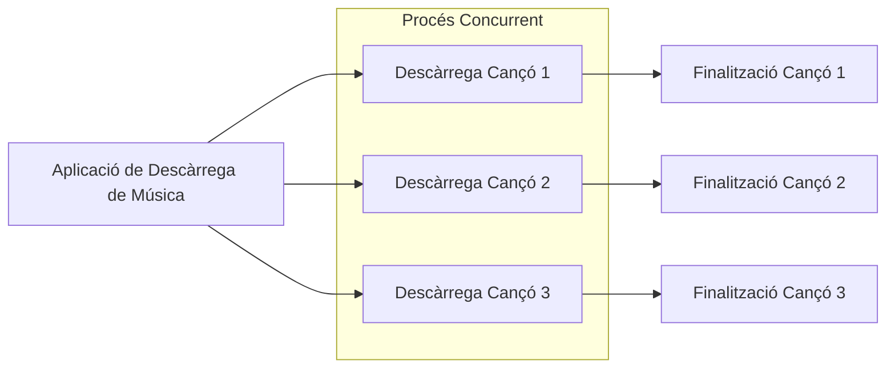

### Exemple de paral·lelisme

Imaginem una cuina professional d'un restaurant durant l'hora punta. Hi ha diverses estacions de treball, cadascuna dedicada a una part específica d'un plat: una per a entrants, una altra per a plats principals, una altra per a postres, etc. Cada estació està ocupada per un xef diferent, i tots ells treballen simultàniament per preparar els seus respectius components del menú. L'objectiu és maximitzar l'eficiència i reduir el temps total de preparació, ja que cada xef treballa de forma paral·lela als altres, concentrant-se en la seva tasca específica sense esperar que les altres estacions completin les seves parts.

Aquesta situació és una analogia perfecta per a la programació paral·lela: diferents processadors (o nuclis) treballen en tasques diferents al mateix temps, cada un concentrant-se en una part específica de la tasca general, amb l'objectiu de millorar el rendiment i la velocitat de processament.

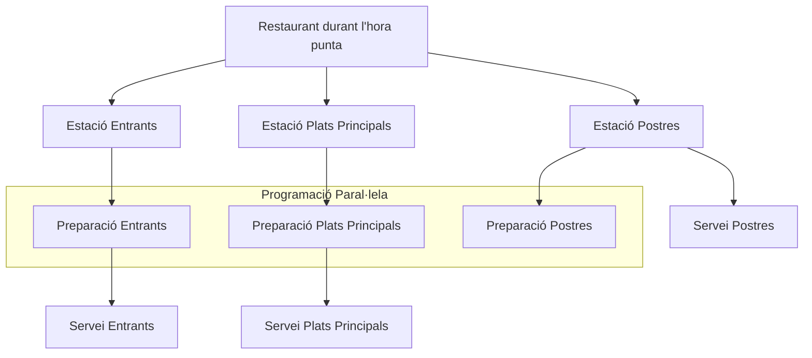

## Models de Concurrència

La teoria de la [concurrència](https://en.wikipedia.org/wiki/Concurrent_computing) ha estat un camp actiu de recerca en Ciències de la Computació. 
En una de les primeres propostes el treball de Carl Adam Petri va ser un pas inicial en els inicis dels 60'. Des d'aquests temps una àmplia varietat de formalismes han estat desenvolupats per a donar exemples i raonar sobre la concurrència.

Hi ha diversos models de concurrència encara que nosaltres ens centrarem en dos dels més utilitzats.

- **Model de pas de missatges:** En aquest model, els components del programa comuniquen i coordinen les seves accions enviant missatges entre ells. Aquest enfocament és útil per evitar problemes com les [situacions de competició](https://ca.wikipedia.org/wiki/Situaci%C3%B3_de_competici%C3%B3), ja que no es comparteixen dades directament entre els fils o processos.
- **Model de memòria compartida:** A diferència del model anterior, el model de memòria compartida permet als fils o processos accedir i modificar dades compartides. Aquest model requereix mecanismes de sincronització, com [semàfors](https://ca.wikipedia.org/wiki/Sem%C3%A0for_(inform%C3%A0tica)) o bloquejos, per assegurar l'accés segur a aquestes dades compartides.


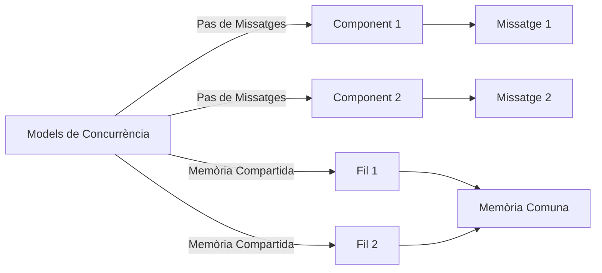

Aquests models representen maneres diferents d'abordar les operacions concurrents, cadascun amb les seves avantatges i reptes. El model de pas de missatges és comú en entorns distribuïts i en arquitectures basades en serveis, mentre que el model de memòria compartida és més habitual en aplicacions on diferents fils treballen en paral·lel dins del mateix entorn de memòria.

## Processos i fils

Els [processos](https://ca.wikipedia.org/wiki/Proc%C3%A9s_inform%C3%A0tic) són programes o aplicacions que estan en execució en una computadora, mentre que els fils són unitats més petites d'execució dins d'un procés.
Solen ser sinònim de programa, o aplicació, encara que pugui ser un conjunt de processos. Aquests poden col·laborar mitjançant [canonades](https://ca.wikipedia.org/wiki/Canonada_(inform%C3%A0tica)) (pipes) o sòcols.

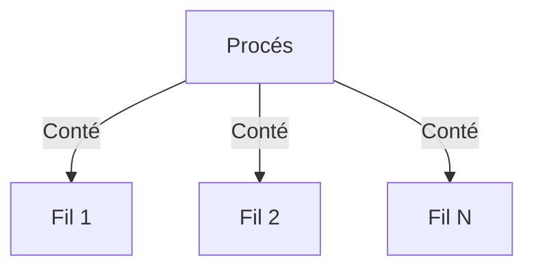

### Característiques de processos i fils

* **Processos**
    - **Independència**: Cada procés s'executa de manera independent i té el seu propi espai de memòria.
    - **Recursos**: Requereixen més recursos perquè cada procés té el seu propi entorn d'execució.
    - **Comunicació**: La comunicació entre processos pot ser més complexa, ja que requereix mecanismes especials com pipes o sockets.
    - **Creació i gestió**: La creació i gestió de processos tendeix a ser més costosa en termes de recursos del sistema.

* **Fils**
    - **Lleugeresa**: Són més lleugers que els processos, ja que comparteixen l'espai de memòria del procés pare.
    - **Compartició de recursos**: Poden compartir dades fàcilment amb altres fils dins del mateix procés.
    - **Creació i canvi de context**: La creació de fils i el canvi de context entre ells és generalment més ràpid que amb els processos.
    - **Riscos**: Són susceptibles a problemes com condicions de cursa en l'accés a dades compartides.

### Avantatges

* **Processos**
    - **Seguretat i estabilitat**: Com que cada procés opera en el seu propi espai de memòria, un error en un procés no afectarà directament els altres.
    - **Multiprocessament**: Són ideals per aplicacions que requereixen aïllament complet, com ara els sistemes operatius o aplicacions que s'executen en entorns separats.

* **Fils**
    - **Eficiència en recursos**: Utilitzen menys recursos que els processos, el que els fa més eficients per a aplicacions amb moltes tasques petites i lleugeres.
    - **Millor rendiment en multiprocessadors**: Poden millorar el rendiment en sistemes amb múltiples processadors, ja que permeten l'execució de diverses tasques en paral·lel.
    - **Temps de resposta**: Poden millorar el temps de resposta en aplicacions interactives.
      Certament! Tant els processos com els fils tenen els seus desavantatges quan s'utilitzen en la programació concurrent. Aquí tens una descripció dels desavantatges de cadascun:

### Desavantatges

* **Processos**
  - **Major Ús de Recursos**: Cada procés requereix un espai de memòria i recursos del sistema independents, la qual cosa pot resultar en un major ús de recursos en comparació amb els fils.
  - **Cost d'Operacions**: Les operacions com iniciar o finalitzar un procés, així com la comunicació entre processos, tendeixen a ser més costoses en termes de temps i recursos del sistema.
  - **Complexitat de Comunicació**: La comunicació entre diferents processos pot ser complexa, ja que cada procés opera en el seu propi espai de memòria aïllat. Això requereix mecanismes especials com IPC (Inter-Process Communication).
  - **Gestió Més Complexa**: La gestió de múltiples processos pot ser més complexa en termes de coordinació i administració del sistema.

* **Fils**
  - **Problemes de Seguretat**: Els fils comparteixen l'espai de memòria del procés pare, el que pot conduir a problemes de seguretat si les dades no són gestionades de manera adequada.
  - **Condició de Cursa**: Els fils són susceptibles a condicions de cursa, on diversos fils intenten modificar dades compartides simultàniament, portant a resultats imprevisibles i errors.
  - **Complexitat de Disseny**: El disseny de programari que utilitza fils pot ser complex, especialment en l'assegurament de l'accés segur i sincronitzat a dades compartides.
  - **Problemes de Sincronització**: La necessitat de sincronitzar el treball de diversos fils pot portar a complicacions com interbloquejos i fam (starvation), on els fils es bloquegen mútuament esperant recursos.

### Tenint en compte Java

La màquina virtual de Java (JVM) normalment opera com un sol procés. A més, una aplicació Java pot crear processos addicionals a través de la classe [ProcessBuilder](https://docs.oracle.com/en/java/javase/11/docs/api/java.base/java/lang/ProcessBuilder.html). Aquesta classe proporciona funcionalitats per crear, executar, aturar, i gestionar [processos del sistema](https://docs.oracle.com/en/java/javase/11/docs/api/java.base/java/lang/Process.html) operatiu fora de la JVM.

D'altra banda, els **fils** en Java són utilitzats per simular processadors i, per defecte, comparteixen l'espai de memòria. Cada fil a Java està associat amb un objecte [Thread](https://docs.oracle.com/en/java/javase/11/docs/api/java.base/java/lang/Thread.State.html), que pot trobar-se en diferents estats durant el seu cicle de vida.

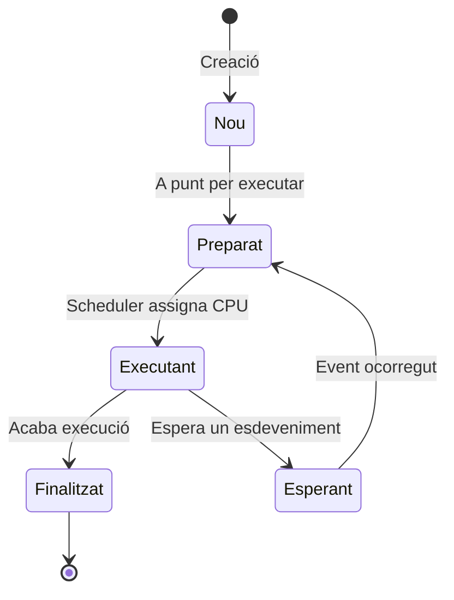
* **Nou (New)**: El procés està sent creat.
*  **Preparat (Ready)**: El procés està a punt per ser executat i espera que el planificador (scheduler) li assigni temps de CPU.
*  **Executant (Running)**: El procés està sent executat.
*  **Esperant (Waiting)**: El procés no pot continuar fins que es produeixi un cert esdeveniment o es compleixi una condició.
*  **Finalitzat (Terminated)**: El procés ha acabat la seva execució.

Un procés pot incloure diversos fils. La diferència clau entre un procés i un fil és que cada procés opera en el seu propi espai d'adreces de memòria independent, mentre que els fils d'un mateix procés comparteixen un únic espai de memòria. El text es centra en la concurrència basada en aquesta memòria compartida, que es realitza mitjançant l'ús de fils.


Cada fil disposa del seu propi **stack** (pila de crides) independent, fet que implica que no comparteixen tipus primitius.
No obstant això, els fils poden compartir objectes situats a la **Heap**, que és un espai de memòria compartit. 
Això requereix precaució en l'execució de codi en múltiples fils que accedeixen simultàniament als mateixos objectes mutables, ja que pot conduir a problemes de concurrencia.


El problema més comú en l'accés simultani per part de múltiples fils és la situació de competició o condició de carrera (race condition), que pot causar la corrupció de l'estat compartit quan diversos fils interactuen amb aquest estat al mateix temps.
Una manera de resoldre aquest problema és mitjançant l'establiment de seccions crítiques en el codi. 
No obstant això, aquesta solució pot conduir a altres problemes, com ara el deadlock, que es produeix quan tots els fils es queden bloquejats i no poden continuar la seva execució.

## Tècniques de disseny concurrent

El disseny concurrent s'enfoca en com estructurar i organitzar programes que executin múltiples tasques simultàniament.

### Principis clau:

1. **Divisió de tasques:** Fragmentar l'aplicació en tasques més petites que es poden executar en paral·lel.
2. **Independència:** Minimitzar les dependències entre tasques concurrents.
3. **Seguretat de fil:** Garantir que els fils accedeixen a les dades compartides de manera segura.

#### Exemple

```java
public class ConcurrentTask implements Runnable {
    @Override
    public void run() {
        // Lògica de la tasca concurrent
    }

    public static void main(String[] args) {
        Thread taskThread = new Thread(new ConcurrentTask());
        taskThread.start();
    }
}
```

## Concurrència a Java

Java ofereix una sèrie d'eines i classes per gestionar la concurrència, com `Thread`, [Runnable](https://docs.oracle.com/en/java/javase/11/docs/api/java.base/java/lang/Runnable.html), i el paquet [java.util.concurrent](https://docs.oracle.com/en/java/javase/11/docs/api/java.base/java/util/concurrent/package-summary.html).

En Java, la concurrència pot ser implementada a dos nivells: l'[API de baix nivell](https://docs.oracle.com/javase/tutorial/essential/concurrency/threads.html) i els [objectes concurrents d'alt nivell](https://docs.oracle.com/javase/tutorial/essential/concurrency/highlevel.html).

Per crear un fil amb l'API de baix nivell, hi ha dues opcions:

1. Estendre la classe `Thread` i reescriure el mètode `run`. No obstant això, no és recomanable utilitzar aquest mètode.
2. Implementar la interfície `Runnable` i el seu mètode `run`. Després, crear un objecte `Thread` passant aquest objecte Runnable al constructor (`new Thread(new MyRunnable())`).

Un cop creat el `Thread`, es pot executar mitjançant el seu mètode `start()`.

# Operacions bàsiques amb fils

## Creació i inici d'un fil

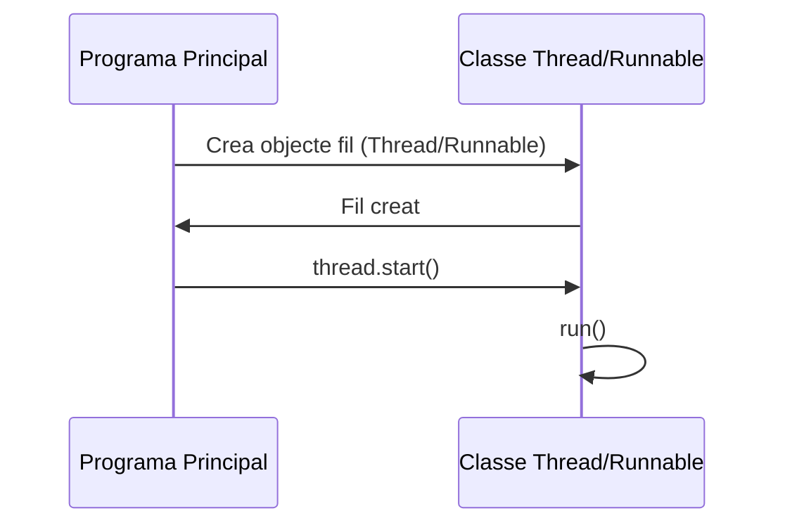

Per crear un fil en Java, pots estendre la classe `Thread` o implementar la interfície `Runnable`.

* **Amb Thread**
```java
// Creació d'un fil estenent la classe Thread
class MyThread extends Thread {
    public void run() {
        System.out.println("El fil s'executa.");
    }
}

// Inici del fil
MyThread myThread = new MyThread();
myThread.start();
```
* **Amb Runnable**
```java
// Creació d'un fil implementant la interfície Runnable
class MyRunnable implements Runnable {
    public void run() {
        System.out.println("El fil s'executa.");
    }
}

// Inici del fil
Thread thread = new Thread(new MyRunnable());
thread.start();
```

## Espera per la finalització d'un fil

El mètode `join()` permet esperar fins que un fil especificat finalitzi la seva execució.

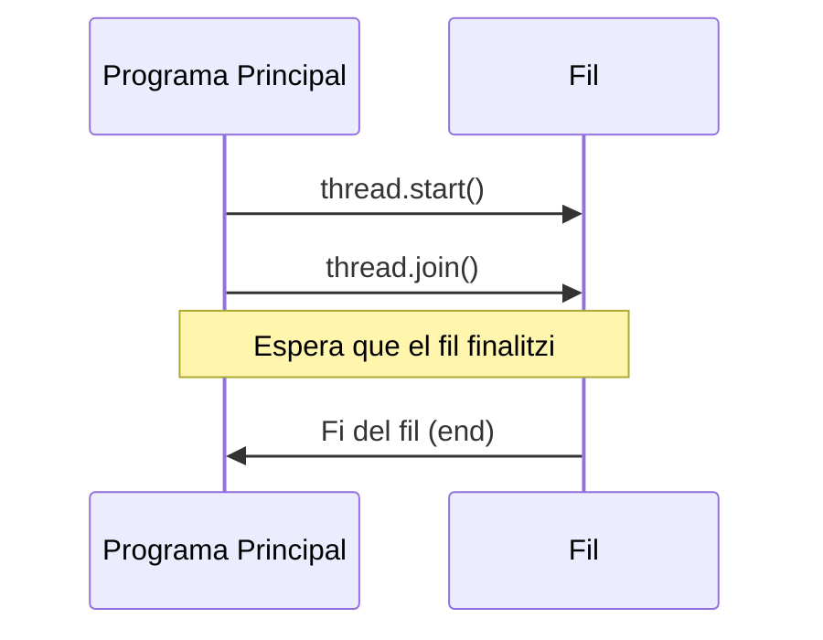

### Exemple
```java
Thread thread = new Thread(new MyRunnable());
thread.start();
try {
    thread.join();  // Espera que el fil finalitzi
} catch (InterruptedException e) {
    e.printStackTrace();
}
```

## Interrupció d'un fil

El mètode `interrupt()` es pot utilitzar per interrompre un fil. El fil pot comprovar si ha estat interromput amb el mètode `isInterrupted()`.

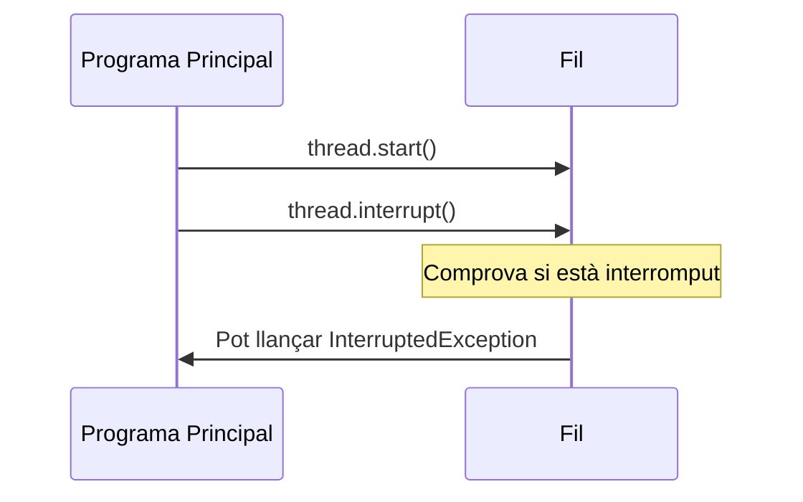

### Exemple
```java
Thread thread = new Thread(new MyRunnable());
thread.start();

// Interrompre el fil
thread.interrupt();
```

## Estat compartit

Els fils poden compartir estat utilitzant variables membres d'una classe. Per a accedir a aquestes variables de manera segura, es pot utilitzar la paraula clau `synchronized`.

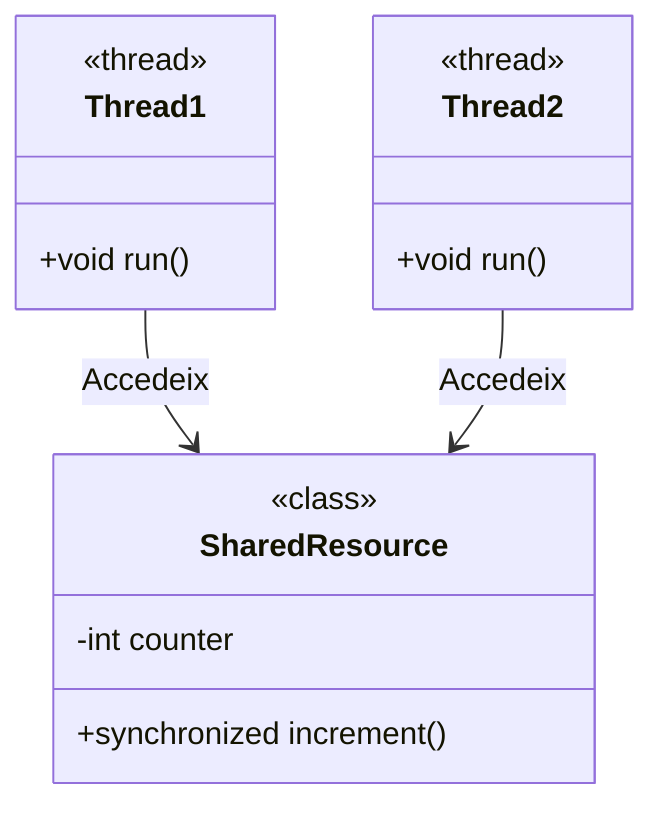

### Exemple
```java
class SharedResource {
    private int counter = 0;

    // Mètode sincronitzat per incrementar el contador
    public synchronized void increment() {
        counter++;
    }
}

SharedResource sharedResource = new SharedResource();
Thread t1 = new Thread(() -> sharedResource.increment());
Thread t2 = new Thread(() -> sharedResource.increment());
t1.start();
t2.start();
```
# Principis de sincronització

La sincronització és un aspecte fonamental de la programació concurrent que permet coordinar l'execució de diferents fils o processos.

## Tipus de Sincronització

* **Sincronització de control**: aquesta sincronització es refereix a la dependència entre tasques: una tasca ha d'esperar que una altra finalitzi abans de poder iniciar. Aquesta espera és gestionada mitjançant mecanismes que indiquen quan una tasca ha completat la seva execució i permeten l'inici de la següent.
* **Sincronització d'accés a dades**: quan diverses tasques volen accedir a la mateixa variable compartida, és necessari garantir que només una tasca ho faci en un moment donat. Aquesta sincronització prevé l'accés concurrent que podria portar a estats inconsistents de la variable.
* **Zona crítica**: una zona crítica és una part del codi on s'accedeix a recursos compartits i que només pot ser executada per una tasca a la vegada per assegurar la consistència.
* **Race conditions**: es refereix a una situació on el resultat del programa depèn de l'ordre en què s'executen les instruccions dels diferents fils. Les race conditions solen ocórrer quan els fils comparteixen estat mutable sense l'adequada sincronització. Per evitar-les cal utilitzar mecanismes de sincronització,  que fan que els objectes implicats siguin **thread-safe**.
Per a garantir-ho, és necessari utilitzar mecanismes com `synchronized`, `locks`, `semaphores`, entre altres.


La relació "[happens-before](https://docs.oracle.com/javase/specs/jls/se7/html/jls-17.html#jls-17.4.5)" en programació concurrent de Java estableix un ordre entre les operacions de diferents fils per determinar com una operació pot ser visible per a un altre fil. Perquè un fil pugui veure de manera garantida el resultat d'una operació d'escriptura feta per un altre fil, l'escriptura ha de "passar abans" de la lectura.

1. **Regla del fil únic**: dins d'un fil, les accions que succeeixen primer en el codi passen abans que les que venen després.
2. **Regla del monitor**: quan un fil surt d'un bloc sincronitzat (unlock), això passa abans que un altre fil entra en qualsevol bloc sincronitzat (lock) per al mateix monitor.
3. **Regla de la variable volàtil**: una escriptura en una variable volàtil passa abans de qualsevol lectura posterior d'aquesta mateixa variable.
4. **Regla d'inici d'un fil**: quan un fil crida `start()`, això passa abans de qualsevol acció dins del fil que s'inicia.
5. **Regla del join**: totes les accions dins d'un fil passen abans que un altre fil completi un `join()` sobre aquest fil.
6. **Transitivitat**: si una operació A passa abans que una operació B, i B passa abans que C, llavors A passa abans que C.

# Disseny thread-safe
Hi ha bàsicament [quatre tècniques](https://web.mit.edu/6.005/www/fa15/classes/20-thread-safety/) per assegurar-nos que no tindrem problemes accedint a variables en memòria compartida:

1. **Confinament**: es basa en el principi de no compartir dades entre fils. Si una variable és usada només dins d'un fil, no es necessita cap mecanisme de sincronització. Això pot ser tan simple com usar variables locals o pot implicar la creació de recursos dedicats que només es fan servir dins d'un sol context de fil.
2. **Immutabilitat**: les dades immutables no poden ser modificades després de la seva creació, per tant, són intrínsecament thread-safe. Això es pot aconseguir fent que tots els camps de l'objecte siguin `final`. Fer-ho assegura que l'objecte no pot canviar d'estat un cop ha estat construït.
3. **Tipus de dades thread-safe**: Java proporciona col·leccions i classes específiques dissenyades per ser thread-safe que gestionen internament la sincronització. És recomanable utilitzar aquestes classes quan es treballa amb dades compartides entre múltiples fils per evitar la complexitat associada amb la gestió manual de la sincronització.
4. **Sincronització**: és una tècnica clau en programació concurrent i es pot fer mitjançant l'ús de blocs sincronitzats o objectes `ReentrantLock`. El més important és assegurar que les seccions crítiques del codi —on es modifiquen dades compartides— estiguin protegides correctament.

# Mecanismes de sincronització

En Java, la sincronització s'aconsegueix mitjançant l'ús de monitors. Un monitor és un objecte que només pot ser posseït per un únic fil a la vegada. Quan un fil vol accedir a una zona crítica de codi, demana la propietat d'un monitor. Si el monitor ja té un propietari, el fil ha d'esperar fins que aquest sigui alliberat.

## Monitors (intrinsic lock)
La paraula reservada `synchronized` s'utilitza per demanar la propietat d’un monitor i accedir a la zona crítica. L'objecte monitor varia en funció del context:

- **En mètodes d’instància**: El monitor és la pròpia instància, permetent només un fil per instància.
- **En mètodes de classe**: El monitor és la classe, permetent només un fil per classe.
- **En blocs de codi**: Cal especificar l'objecte monitor entre parèntesis.

### Exemple amb mètodes d'instància

```java
public class SynchronizedCounter {
    private int c = 0;
    public synchronized void increment() {
        c++;
    }
    public synchronized void decrement() {
        c--;
    }
    public synchronized int value() {
        return c;
    }
}
```
**Conseqüències de la sincronització**:

1. Dos fils no poden cridar simultàniament a dos mètodes sincronitzats de la mateixa instància o classe; les crides subseqüents se suspenen fins que el primer fil acabi.
2. Quan un mètode sincronitzat finalitza, estableix una relació "happens-before", assegurant que els canvis siguin visibles per les crides posteriors.

És important fer la mínima feina necessària dins d'un bloc sincronitzat, com llegir i, si cal, transformar les dades.

### Exemple amb blocs de codi
```java
public class MsLunch {
    private long c1 = 0;
    private long c2 = 0;
    private Object lock1 = new Object();
    private Object lock2 = new Object();

    public void inc1() {
        synchronized(lock1) {
            c1++;
        }
    }
    public void inc2() {
        synchronized(lock2) {
            c2++;
        }
    }
}
```
## Wait / Notify (guarded lock)
Els mètodes `wait()` i `notify()` de Java permeten la sincronització de fils mitjançant un "guarded lock" o bloqueig vigilat. Aquesta tècnica és útil quan volem que un fil esperi (wait) fins que es compleixi una certa condició abans de procedir, i que un altre fil notifiqui (notify) quan la condició es compleixi.

1. **Ús correcte de wait() i notify()**: És essencial cridar `wait()` i `notify()` dins d'un bloc sincronitzat per evitar "race conditions" que podrien ocórrer si l'estat compartit canvia entre la comprovació de la condició i la crida al mètode `wait()`.
2. **Comprovació de la condició en un bucle**: És important envoltar la crida a `wait()` amb un bucle `while` que comprovi la condició. Això és perquè pot haver-hi "spurious wakeups" (despertars espontanis) o que múltiples fils estiguin esperant per diferents condicions, i `notifyAll()` podria despertar fils que encara no tenen la seva condició satisfer.
3. **Notificació**: Els mètodes `notify()` i `notifyAll()` s'utilitzen per despertar fils que estan esperant a que es compleixi una condició. `notify()` desperta un únic fil, mentre que `notifyAll()` desperta a tots els fils, el que pot ser més segur quan múltiples fils esperen condicions que poden ser satisferes simultàniament.

### Exemple

```java
public class SharedResource {
    private boolean joy = false;

    public synchronized void waitForJoy() {
        // Espera dins d'un bucle per comprovar la condició
        while (!joy) {
            try {
                wait(); // Espera fins que es notifiqui l'alegria
            } catch (InterruptedException e) {
                // Handle exception
            }
        }
        System.out.println("Alegria aconseguida!");
    }

    public synchronized void generateJoy() {
        joy = true; // Estableix l'alegria
        notifyAll(); // Notifica tots els fils que esperen que l'alegria ha estat establerta
    }
}
```

En aquest exemple, `waitForJoy()` espera dins d'un bucle fins que la variable `joy` esdevingui `true`. Quan `generateJoy()` és cridat, estableix la variable `joy` a `true` i notifica a tots els fils que esperen que poden continuar. Els mètodes `wait()` i `notifyAll()` es criden dins d'un bloc sincronitzat que utilitza l'objecte `SharedResource` com a monitor.

# La llibreria java.util.concurrent

La llibreria `java.util.concurrent` és una de les aportacions més importants a la programació concurrent en Java, oferint un conjunt ric i eficient de mecanismes de sincronització, col·leccions thread-safe, executors, utilitats per al treball amb tasques futures, sincronitzadors, i més. Des de la versió JDK 11, aquesta llibreria ha estat ampliada i millorada per facilitar el desenvolupament de codi concurrent robust i de gran rendiment. A continuació, s'expliquen algunes de les característiques principals i s'ofereixen exemples d'ús.

## Executors i thread-pools

Els executors són fonamentals per gestionar fils i tasques de manera eficient. Permeten que els desenvolupadors deleguin l'execució de tasques a un pool de fils sense haver de gestionar-los manualment.

### Exemple d'[ExecutorService](https://docs.oracle.com/en/java/javase/11/docs/api/java.base/java/util/concurrent/ExecutorService.html):

```java
import java.util.concurrent.ExecutorService;
import java.util.concurrent.Executors;
import java.util.concurrent.TimeUnit;

public class ThreadPoolExample {
    public static void main(String[] args) {
        ExecutorService executor = Executors.newFixedThreadPool(3);

        // Submit tasques per a la seva execució
        for (int i = 0; i < 5; i++) {
            int taskId = i;
            executor.submit(() -> {
                System.out.println("Executant tasca " + taskId + " " + 
                                   "en el fil " + Thread.currentThread().getName());
            });
        }
        
        // Apaga l'executor una vegada que hem acabat
        executor.shutdown();
        try {
            if (!executor.awaitTermination(800, TimeUnit.MILLISECONDS)) {
                executor.shutdownNow();
            } 
        } catch (InterruptedException e) {
            executor.shutdownNow();
        }
    }
}
```

## Col·leccions concurrents

Les col·leccions concurrents com `ConcurrentHashMap`, `CopyOnWriteArrayList`, i `BlockingQueue` són dissenyades per ser usades en entorns multithread sense la necessitat de sincronització externa.

### Exemple de [ConcurrentHashMap](https://docs.oracle.com/en/java/javase/11/docs/api/java.base/java/util/concurrent/ConcurrentHashMap.html):

```java
import java.util.concurrent.ConcurrentHashMap;

public class ConcurrentHashMapExample {
    public static void main(String[] args) {
        ConcurrentHashMap<String, String> map = new ConcurrentHashMap<>();
        
        // Operacions thread-safe en el mapa
        map.put("clau1", "valor1");
        String valor = map.get("clau1");
        System.out.println("Valor associat amb 'clau1': " + valor);
    }
}
```

## Futures i Callable

La interfície `Callable` representa una tasca que retorna un resultat i pot llançar una excepció. Els `Future` proporcionen un mètode per recuperar el resultat d'una tasca asíncrona.

### Exemple de [Callable](https://docs.oracle.com/en/java/javase/11/docs/api/java.base/java/util/concurrent/Callable.html) i [Future](https://docs.oracle.com/en/java/javase/11/docs/api/java.base/java/util/concurrent/Future.html):

```java
import java.util.concurrent.Callable;
import java.util.concurrent.Future;
import java.util.concurrent.ExecutorService;
import java.util.concurrent.Executors;

public class CallableFutureExample {
    public static void main(String[] args) throws Exception {
        ExecutorService executor = Executors.newSingleThreadExecutor();
        Callable<Integer> callableTask = () -> {
            // Simula treball intensiu
            TimeUnit.SECONDS.sleep(2);
            return 123;
        };
        
        Future<Integer> future = executor.submit(callableTask);
        
        // Això esperarà fins que la tasca es completi per obtenir el resultat
        Integer result = future.get();
        System.out.println("Resultat de la tasca callable: " + result);
        
        executor.shutdown();
    }
}
```

## Sincronitzadors

Classes com `CountDownLatch`, `CyclicBarrier`, i `Semaphore` són utilitzades per controlar el flux de fils basant-se en certs esdeveniments o condicions.

### Exemple de [CountDownLatch](https://docs.oracle.com/en/java/javase/11/docs/api/java.base/java/util/concurrent/CountDownLatch.html):

```java
import java.util.concurrent.CountDownLatch;

public class CountDownLatchExample {
    public static void main(String[] args) throws InterruptedException {
        CountDownLatch latch = new CountDownLatch(3);

        // Inicia tres fils que fan alguna feina
        for (int i = 0; i < 3; i++) {
            new Thread(() -> {
                // Realitza alguna feina
                latch.countDown(); // Redueix el comptador
            }).start();
        }
        
        latch.await(); // Espera que el comptador arribi a zero
        System.out.println("Totes les tasques han acabat.");
    }
}
```
# Pas de missatges

El pas de missatges és una estratègia de concurrència on els components (com fils o processos) intercanvien dades a través de missatges en lloc d'accedir directament a recursos compartits. Això es pot fer tant dins d'un únic procés com entre múltiples processos.

- **Dins d'un procés**, els fils poden utilitzar estructures de dades com les `BlockingQueue` de la llibreria `java.util.concurrent` per enviar i rebre missatges. Aquests missatges són objectes que un fil productor posa a la cua i que un fil consumidor treu de la cua, permetent una comunicació segura i eficient entre fils sense necessitat de sincronització explícita.
- **Entre Processos**, el pas de missatges es pot implementar utilitzant mecanismes de comunicació interprocessual (IPC), com ara sockets, pipes anomenats (named pipes) o memòria compartida amb accessos sincronitzats. Cada procés opera en el seu propi espai d'adreces, així que la comunicació ha de ser gestionada pel sistema operatiu.

## Models de programació síncron i asíncron

El pas de missatges es pot realitzar seguint models de programació síncrona o asíncrona.

- **Síncrona**: el remitent espera una resposta immediata després d'enviar un missatge. L'execució només continua un cop s'ha rebut aquesta resposta.

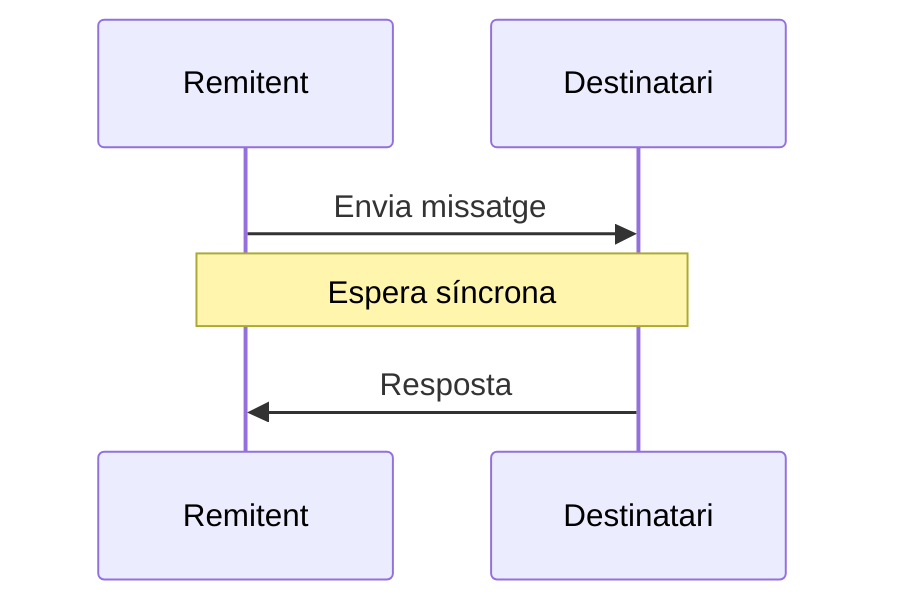


- **Asíncrona**: el remitent no espera una resposta immediatament després d'enviar un missatge. Pot continuar amb altres tasques i tractar la resposta quan aquesta arriba.

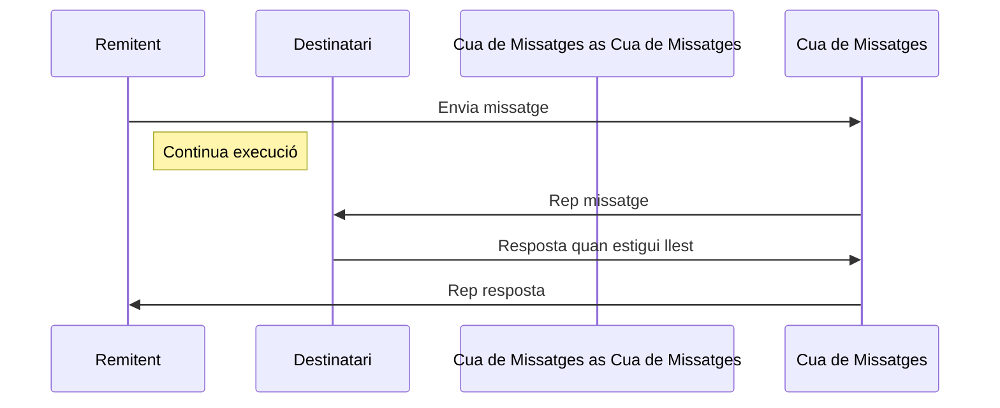

## Gestió de peticions

En entorns de programació concurrents, la gestió de peticions pot ser realitzada de manera síncrona o asíncrona. Aquests dos enfocaments tenen implicacions significatives en el disseny del sistema, la gestió de recursos i l'experiència d'usuari. A continuació, es detallen aquests dos mètodes amb exemples:

### Gestió síncrona

En la gestió síncrona de peticions, el fil que fa la petició es bloqueja fins que la resposta està disponible. Aquest model és senzill d'entendre i implementar, però pot ser menys eficient en termes d'ús de recursos, ja que els fils són inactius mentre esperen les respostes.

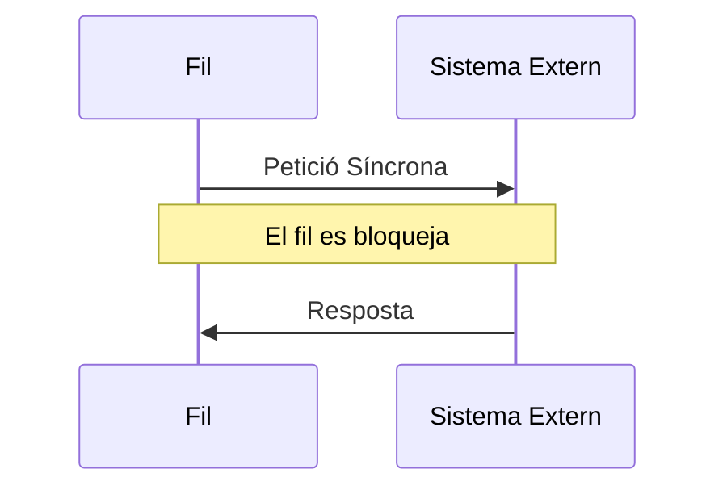

#### Exemple

Imaginem una aplicació on un fil principal realitza una petició a una base de dades i espera síncronament la resposta:

```java
public class SyncRequestHandler {
    public Data requestDataFromDatabase() {
        // Petició a la base de dades
        Data response = database.query("SELECT * FROM table");
        return response; // El fil es bloqueja fins que la resposta està disponible
    }
}
```

En aquest exemple, la crida `database.query` bloqueja el fil fins que la base de dades retorna les dades.

### Gestió asíncrona

En la gestió asíncrona, el fil que fa la petició no es bloqueja. En canvi, registra una crida de retorn (callback) o utilitza un futur per a manejar la resposta quan aquesta està disponible. Això permet que el fil continuï fent altres tasques mentre la petició està sent processada.

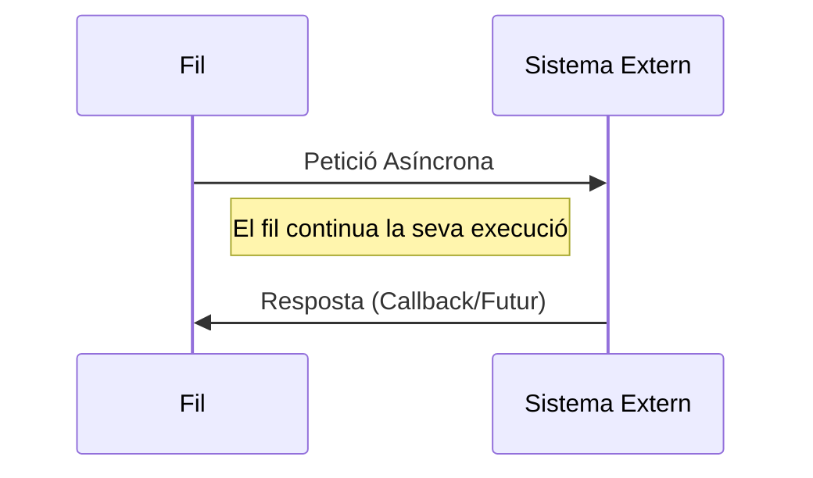

#### Exemple

Imaginem una aplicació que fa peticions a un servei web de forma asíncrona:

```java
public class AsyncRequestHandler {
    public void requestDataFromService() {
        service.queryAsync("http://api.example.com/data", this::onResponseReceived);
    }

    private void onResponseReceived(Data response) {
        // Manejar la resposta aquí
    }
}
```

Aquí, `service.queryAsync` no bloqueja el fil. En canvi, el mètode `onResponseReceived` serà cridat quan la resposta estigui disponible.

L'elecció entre gestió síncrona o asíncrona de peticions depèn de diversos factors, incloent els requisits de rendiment, l'arquitectura del sistema i la naturalesa de les tasques realitzades. La gestió asíncrona és especialment útil en aplicacions que requereixen alta escalabilitat i una bona resposta sota càrrega, mentre que la gestió síncrona pot ser suficient per a aplicacions amb requisits més simples i menys exigències de concurrència.

