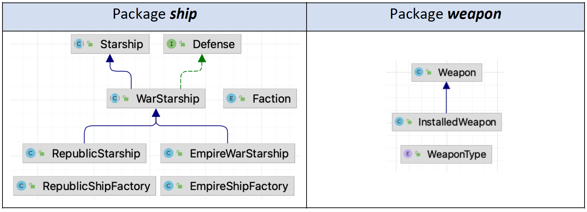

### *A long time ago, in a galaxy far, far away...*


Són temps adversos per a la rebel·lió. Encara que l'Estrella de la Mort ha estat destruïda per una errada al codi font,
els dev teams imperials han planificat desenvolupar un algorisme infal·lible per poder combatre a les forces rebels i
així poder apoderar-se de la galàxia.

Després d'escapar de la terrible Flota Imperial, un grup de guerrers i guerreres per la llibertat, encapçalats per tu,
ha establert una nova base secreta en el remot Institut Eugeni d’Ors a Vilafranca del Penedès.

El malvat Lord Darth Teacher, obsessionat per la qualitat del codi i la programació orientada a objectes, ha enviat les
especificacions i un diagrama de classes als devTroopers perquè desenvolupin aquest algorisme....

# Objectius de l'activitat

Repassar els conceptes d’herència, classes abstractes, interfícies i introduir el patró de disseny Factory.

# Conceptes previs

L’aplicació a desenvolupar ha de suposar un combat just i net on la superioritat de l’Imperi pugui esclafar la rebel·lió
i de pas serveixi per repassar:

### Herència

L'herència és el mecanisme més utilitzat per a aconseguir alguns dels objectius més preuats en el desenvolupament de
programari com ho són la reutilització i l'extensibilitat. A través d'ella, els dissenyadors poden crear noves classes
partint d'una classe o d'una jerarquia de classes preexistent (ja comprovades i verificades) evitant amb això el
redisseny, la modificació i verificació de la part ja implementada. L'herència facilita la creació d'objectes a partir
d'uns altres ja existents i implica que una subclasse obté tot el comportament (mètodes) i finalment els atributs (
variables) de la seva superclase.

### Classes abstractes

Les classes abstractes, com el seu nom l'indica, són una cosa abstracta, no representen una cosa específica i les podem
usar per a crear altres classes. No poden ser instanciades, per la qual cosa no podem crear nous objectes amb elles.

### Interfícies

Una interfície és un mecanisme per a enunciar un conjunt d'especificacions i comportaments que altres classes
implementaran.

### Patró *factory* (factoria)

El patró [Factory](https://www.youtube.com/watch?v=lLvYAzXO7Ek), o patró de disseny Mètode Factoria, descriu un
enfocament de programació que serveix per a crear objectes sense haver d'especificar la seva classe exacta. Això vol dir
que l'objecte creat pot intercanviar-se amb flexibilitat i facilitat. Per a implementar aquest mètode, els
desenvolupadors utilitzen el Factory Method, que dona nom a aquest patró. El seu ús pot especificar-se en una interfície
o implementar-se mitjançant la classe fill o la classe basi i opcionalment sobreescriure's (mitjançant classes
derivades). En fer-ho, el patró o mètode pren el lloc del constructor de classe normal per a separar la creació
d'objectes dels propis objectes.


# Enunciat de l'activitat

Els espies rebels han robat el següent codi d’un dels repositoris git propietat de l’Imperi on gràcies als coneixements
avançats en programació i enginyeria inversa de l’equip de programadors i programadores rebels s’ha pogut extreure un
diagrama de classes del paquet de dades robades i s’ha pujat a un repositori segur (aquest) el resultat de les seves
investigacions. Aquest codi, encara que útil, està **ple d’errors**.

L’informe del departament tècnic pot resumir-se en:

### Programa principal

```java
public static void main(String[]args){
        System.out.println("A long time ago, in a galaxy far, far away...");
        EmpireWarStarship stellarDestructor=EmpireShipFactory.stellarDrestroyer("001-destroyer");
        RepublicStarship xWing=RepublicShipFactory.xWing("001-x-wing");
        System.out.println(stellarDestructor);
        System.out.println(xWing);
        duel(xWing,stellarDestructor,MAX_ROUNDS);
        }
```

### Exemple de sortida

A long time ago, in a galaxy far, far away...

```text
EmpireWarStarship
    id: 001-destroyer
    Manufacturer: Kuat Drive Yards (KDY)
    Faction: EMPIRE
    Status:
        hull integrity: 10000.00
        shields: 100.00 %
        is flying: FALSE
        is destroyed: FALSE
    Weaponry:
        Power: 11400.00
        Weapon{bonusDamage=1.0, weaponType=TRACTOR_BEAM} [count=10}
        Weapon{bonusDamage=1.0, weaponType=ION_CANNON} [count=60}
        Weapon{bonusDamage=1.0, weaponType=WEIGHT_TURBO_LASER_TURRET} [count=60}
        Weapon{bonusDamage=1.0, weaponType=MEDIUM_TURBO_LASER_TURRET} [count=60}
        Weapon{bonusDamage=1.0, weaponType=LIGHT_TURBO_LASER_TURRET} [count=60}

RepublicStarship
    id: 001-x-wing
    Manufacturer: Incom Corporation (IC)
    Faction: REPUBLIC
    Status:
        hull integrity: 1000.00
        shields: 100.00 %
        is flying: FALSE
        is destroyed: FALSE
    Weaponry:
        Power: 460.00
        Weapon{bonusDamage=1.0, weaponType=LASER_CANON} [count=4}
        Weapon{bonusDamage=1.0, weaponType=PROTON_TORPEDO} [count=2}

WARNING: 001-x-wing is attacking 001-destroyer
    Initial battle status
    <********     ********>
        001-x-wing [1000.00] - ((100.00))
        001-destroyer [10000.00] - ((100.00))

    REPUBLIC <-|-> EMPIRE --> ROUND 1 ... --> FIGHT !!! <--
        001-x-wing [1000.00] - ((100.00))
        001-destroyer [9540.00] - ((98.85))

    REPUBLIC <-|-> EMPIRE --> ROUND 2 ... --> FIGHT !!! <--
        001-x-wing [1000.00] - ((100.00))
        001-destroyer [9085.29] - ((97.70))

    <******** NEXT TURN ********>

    EMPIRE <-|-> REPUBLIC --> ROUND 1 ... --> FIGHT !!! <--
        001-x-wing is Destroyed

Process finished with exit code 0
```

### Diagrama de classes



La teva missió es desenvolupar una aplicació que utilitzi el paquet de dades robades per simular el combat entre un
**x-Wing** i un **Destructor Imperial** per poder esbrinar si hi ha algun punt feble a la maquinària de guerra de
l’Imperi.
Per això necessitaràs codificar l’estructura de classes correctament, utilitzant els conceptes **d’herència, classes
abstractes,
interfícies i el patró factory**. La mecànica del combat es senzilla, suma la potència (*power*) de tot l’armament i
enfronta les dues naus (el típic joc de combat per torns). Agafa't la llibertat de desenvolupar la teva solució com
vulguis,
utilitza la teva creativitat.


