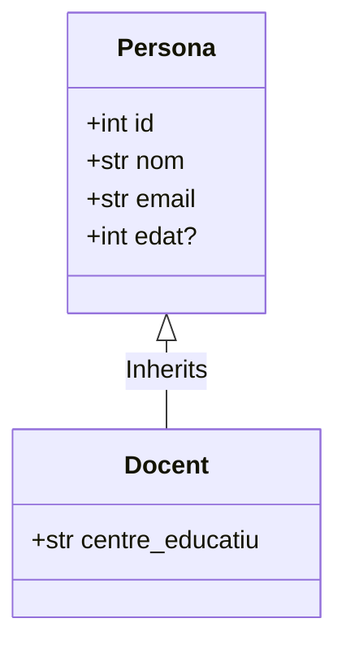

# Activitat: implementació d'un CRUD bàsic amb validacions

### Objectius

1. Definir models de dades amb Pydantic.
2. Implementar operacions **CRUD** (_Create_, _Read_, _Update_, _Delete_).
3. Realitzar validacions.
4. Documentar les vostres rutes API amb docstrings.

### Descripció
Heu de construir una API utilitzant FastAPI que gestioni docents. Cada **docent** és una **persona**, però amb l'atribut addicional `centre_educatiu` que indica on treballen.

### Criteris d'acceptació
- Utilitzar la llibreria FastAPI.
- Definir una classe `Persona` amb els següents camps:
    - `id`: Un identificador únic per a la persona.
    - `nom`: El nom de la persona.
    - `email`: El correu electrònic de la persona.
    - `edat`: L'edat de la persona (pot ser opcional).
- Definir una classe `Docent` que hereti de `Persona` i afegeixi el camp `centre_educatiu` per indicar on treballa.
- Cal **assegurar** que:
  - `id` és únic.
  - `email` pertany **exclusivament** al domini **@ies-eugeni.cat**.
  - `edat` es major que 0.
- Implementar rutes API per a les operacions CRUD.
- Documentar totes les funcions amb docstrings.

### Diagrama de classes

